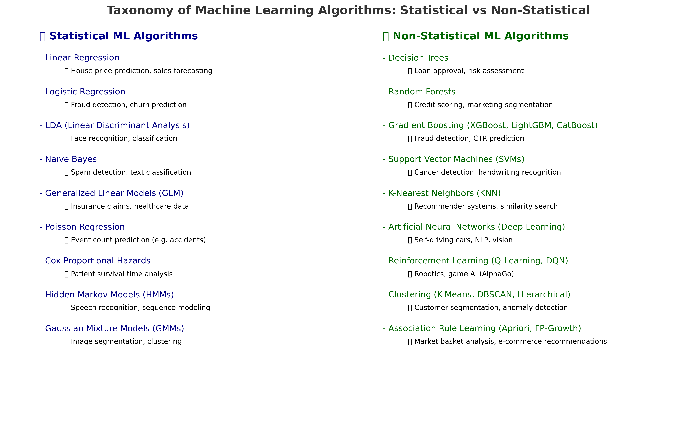

# Difference between Statistical Machine Learning Algorithms and Non-Statistical Machine Learning Algorithms?

As a **data scientist**, when we talk about **statistical machine learning algorithms vs. non-statistical algorithms**, the key difference lies in their **foundations, assumptions, and how they model the data**.

---

# 🔹 1. Statistical Machine Learning Algorithms

### ✅ Definition:

* These algorithms are built on **statistical theory** and rely on assumptions about the **probability distribution** of data.
* They use **parameters** (coefficients, likelihoods, probabilities) that are **interpretable** in a mathematical/statistical sense.
* The goal is often **inference** (understanding relationships, hypothesis testing) in addition to **prediction**.

### ⚙️ Characteristics:

* Require assumptions about data distribution (e.g., normality, linearity, independence).
* Often parametric (fixed number of parameters).
* More interpretable but may underperform when data relationships are highly complex.

### 📌 Examples of Statistical ML Algorithms:

1. **Linear Regression** (predict continuous values)
2. **Logistic Regression** (binary/multi-class classification)
3. **Linear Discriminant Analysis (LDA)**
4. **Naïve Bayes Classifier**
5. **Generalized Linear Models (GLM)**
6. **Poisson Regression**
7. **Cox Proportional Hazards Model** (survival analysis)
8. **Hidden Markov Models (HMMs)**
9. **Gaussian Mixture Models (GMMs)**

### 🌍 Real-World Use Cases:

* **Linear Regression**: Predicting house prices, sales forecasting.
* **Logistic Regression**: Customer churn prediction, fraud detection, disease diagnosis (yes/no).
* **Naïve Bayes**: Spam email classification, text categorization.
* **LDA**: Face recognition (dimensionality reduction + classification).
* **Survival Models (Cox)**: Patient survival time prediction in healthcare.

---

# 🔹 2. Non-Statistical Machine Learning Algorithms

### ✅ Definition:

* These are **algorithmic approaches** not strictly bound to classical statistics.
* They focus more on **prediction accuracy** and **pattern discovery** than interpretability.
* Many are **non-parametric** (number of parameters grows with data).
* They are often more flexible and can capture **non-linear** and **complex relationships**.

### ⚙️ Characteristics:

* Do not assume data follows a specific distribution.
* Often computationally intensive (require more data + compute power).
* Can overfit without proper regularization.
* Provide **high accuracy** in many modern applications (vision, NLP, recommender systems).

### 📌 Examples of Non-Statistical ML Algorithms:

1. **Decision Trees**
2. **Random Forests**
3. **Gradient Boosting (XGBoost, LightGBM, CatBoost)**
4. **Support Vector Machines (SVMs)**
5. **K-Nearest Neighbors (KNN)**
6. **Artificial Neural Networks (ANNs, Deep Learning)**
7. **Reinforcement Learning Algorithms** (Q-Learning, Deep Q Networks)
8. **Clustering (K-Means, DBSCAN, Hierarchical)**
9. **Association Rule Learning (Apriori, FP-Growth)**

### 🌍 Real-World Use Cases:

* **Decision Trees / Random Forests**: Credit scoring, loan approval, customer segmentation.
* **Gradient Boosting (XGBoost)**: Kaggle competitions, fraud detection, click-through rate prediction.
* **SVMs**: Image classification, handwriting recognition, cancer detection (tumor classification).
* **KNN**: Recommender systems (movie/music recommendations), document similarity.
* **Neural Networks**: Self-driving cars, speech recognition, image generation, ChatGPT-like systems.
* **Clustering (K-Means, DBSCAN)**: Market segmentation, anomaly detection in networks, grouping similar products.
* **Reinforcement Learning**: Robotics, game AI (AlphaGo), personalized recommendations.

---

# 🔹 3. Side-by-Side Comparison

| Aspect                      | **Statistical Algorithms**                              | **Non-Statistical Algorithms**            |
| --------------------------- | ------------------------------------------------------- | ----------------------------------------- |
| **Foundation**              | Probability & statistics                                | Algorithmic / computational               |
| **Assumptions**             | Require strong assumptions (e.g., linearity, normality) | Few/no assumptions about data             |
| **Complexity Handling**     | Good for simple, linear relationships                   | Handle complex, non-linear patterns       |
| **Interpretability**        | High (coefficients are meaningful)                      | Low (black-box, especially deep learning) |
| **Performance on Big Data** | May underperform                                        | Often superior                            |
| **Use Case**                | Inference + prediction                                  | Mostly prediction                         |

---

# 🔹 4. Real-World Analogy

* **Statistical algorithms** are like a **doctor using medical guidelines**: assumes certain patterns (e.g., symptoms → disease mapping) and explains why something happens.
* **Non-statistical algorithms** are like a **black-box AI medical assistant**: doesn’t explain much but finds patterns from huge medical histories and images, often with higher accuracy.

---

✅ **In summary:**

* Use **statistical ML algorithms** when **interpretability, hypothesis testing, and inference** are important.
* Use **non-statistical ML algorithms** when **accuracy, scalability, and handling complex relationships** matter most.

---

