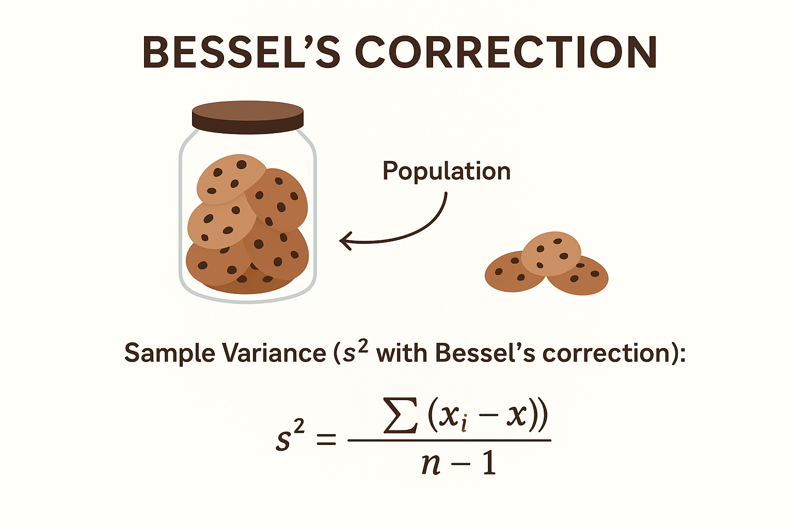

# Bessel’s Correction

---

Got it 👍 You’re asking about the **Bessel’s correction** (sometimes miswritten as *Bassein correction*). Let’s break it down step by step in a **school student-friendly way** with **real world analogy + math**.

---

## 1. What is Bessel’s Correction?

When we calculate **variance** of a **sample** (a smaller group taken from a bigger population), we slightly adjust the formula to avoid **underestimating** the true variance of the population.

👉 This adjustment is called **Bessel’s Correction**.
It means: instead of dividing by **n** (the number of items in the sample), we divide by **n - 1**.

Formula:

* **Population Variance (σ²):**

$$
\sigma^2 = \frac{\sum (x_i - \mu)^2}{N}
$$

* **Sample Variance (s² with Bessel’s correction):**

$$
s^2 = \frac{\sum (x_i - \bar{x})^2}{n-1}
$$

---

## 2. Why n-1 instead of n?

Imagine you’re guessing how far things are spread out:

* If you only use the sample mean ( $\bar{x}$ ), it already uses up some "information" from the data.
* This makes the sample look **less spread out** than the whole population.
* Dividing by **n-1** instead of **n** gives back that “lost spread” → makes variance an **unbiased estimator**.

---

## 3. Real World Analogy 🎒

Think of a classroom of 30 students (population). You want to know how much their marks vary.

* But you only check **5 students’ marks** (sample).
* If you use just **n (5)**, your estimate of variance will be **too small**, because the sample "sticks too closely" to its own average.
* By dividing by **n-1 (4)**, you **compensate** for this closeness.

🔎 Analogy:
Imagine measuring the average height of students by picking just a few. If you adjust by dividing by fewer students (n-1), you’re saying:
*"Since we didn’t see everyone, let’s stretch our result a little to better reflect the whole class."*

---

## 4. Example (step-by-step)

Suppose sample marks are:
$6, 8, 10$ (n = 3 students)

1. Mean = (6+8+10)/3 = 24/3 = 8

2. Squared differences:

   * (6-8)² = 4
   * (8-8)² = 0
   * (10-8)² = 4
     Sum = 8

3. Variance without correction (divide by n):

$$
= \frac{8}{3} = 2.67
$$

4. Variance with Bessel’s correction (divide by n-1):

$$
= \frac{8}{2} = 4
$$

👉 Notice: The corrected variance (4) is **larger** → better estimate of population variance.

---

## 5. Super-Simple Analogy 🍪

Think of **cookies in a jar**:

* Population = the whole jar.
* Sample = just a handful of cookies.
* If you only measure the handful, you might think: "All cookies are about the same size!"
* But in reality, the jar might have **smaller and bigger cookies** too.
* Bessel’s correction is like saying: *"Wait, since we only saw a few, let’s add a little extra spread so we don’t underestimate the whole jar’s variety."*

---

✅ In summary:

* **Bessel’s correction = divide by (n-1) instead of n**
* Purpose = correct bias when estimating population variance from a sample
* Real-world = checking few students, handful of cookies, measuring only part of a group

---

