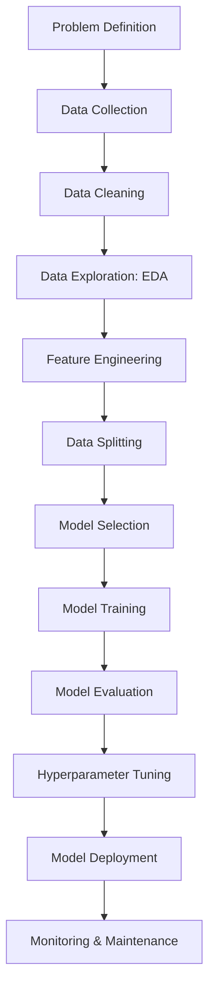

## 🧠 Machine Learning Workflow (Beginner Friendly)

### 🔢 Step-by-step Tasks:

1. **Problem Definition**
   Understand the goal – classification, regression, clustering, etc.

2. **Data Collection**
   Gather data from files, databases, APIs, sensors, etc.

3. **Data Cleaning**
   Handle missing values, remove duplicates, correct data types.

4. **Data Exploration (EDA)**
   Visualize data, understand distributions, relationships.

5. **Feature Engineering**
   Select, create, or transform input features for model.

6. **Data Splitting**
   Split data into training, validation, and test sets.

7. **Model Selection**
   Choose appropriate algorithm(s) (e.g., Decision Tree, SVM, etc.).

8. **Model Training**
   Feed training data into algorithm to learn patterns.

9. **Model Evaluation**
   Use metrics (accuracy, RMSE, F1-score) on validation/test set.

10. **Hyperparameter Tuning**
    Optimize model settings using techniques like Grid Search.

11. **Model Deployment**
    Integrate trained model into a product or service.

12. **Monitoring & Maintenance**
    Track performance, retrain if data/concepts drift.

---

## 📊 Mermaid Diagram of Machine Learning Workflow

Copy and paste this into a `.md` file that supports Mermaid (e.g., GitHub, Obsidian, VS Code with extension):

