# 🐍 Python Coding Problems for Absolute Beginners
### Learn by Solving — 20 Classic Problems with Step-by-Step Explanations

> **How to use this guide:** Each problem includes a plain-English explanation, a visual diagram of the logic, and clean Python code. Try to solve it yourself first, then check the solution!

---

## 📚 Table of Contents

| # | Problem | Difficulty |
|---|---------|-----------|
| 1 | [Odd or Even Number](#1-odd-or-even-number) | 🟢 Beginner |
| 2 | [Sum of N Numbers](#2-sum-of-n-numbers) | 🟢 Beginner |
| 3 | [Prime Number Check](#3-prime-number-check) | 🟡 Easy |
| 4 | [Factorial of a Number](#4-factorial-of-a-number) | 🟡 Easy |
| 5 | [Fibonacci Sequence](#5-fibonacci-sequence) | 🟡 Easy |
| 6 | [Palindrome Check](#6-palindrome-check) | 🟡 Easy |
| 7 | [Reverse a String](#7-reverse-a-string) | 🟢 Beginner |
| 8 | [Count Vowels in a String](#8-count-vowels-in-a-string) | 🟢 Beginner |
| 9 | [Find Largest & Smallest](#9-find-largest--smallest-in-a-list) | 🟢 Beginner |
| 10 | [Armstrong Number](#10-armstrong-number) | 🟡 Easy |
| 11 | [Perfect Number](#11-perfect-number) | 🟡 Easy |
| 12 | [Number Pattern Printing](#12-number-pattern-printing) | 🟡 Easy |
| 13 | [FizzBuzz](#13-fizzbuzz) | 🟢 Beginner |
| 14 | [Linear Search](#14-linear-search) | 🟡 Easy |
| 15 | [Binary Search](#15-binary-search) | 🟠 Intermediate |
| 16 | [Bubble Sort](#16-bubble-sort) | 🟠 Intermediate |
| 17 | [Selection Sort](#17-selection-sort) | 🟠 Intermediate |
| 18 | [Anagram Check](#18-anagram-check) | 🟡 Easy |
| 19 | [GCD & LCM](#19-gcd--lcm) | 🟡 Easy |
| 20 | [Caesar Cipher](#20-caesar-cipher-encryption) | 🟠 Intermediate |

**Difficulty:** 🟢 Beginner &nbsp;|&nbsp; 🟡 Easy &nbsp;|&nbsp; 🟠 Intermediate

---

## 1. Odd or Even Number

### 📖 Concept
A number is **even** if it is perfectly divisible by 2 (no remainder).
A number is **odd** if dividing by 2 leaves a remainder of 1.

The **modulus operator `%`** gives the remainder of a division.

```
┌─────────────────────────────────────────────────────────────┐
│                    HOW IT WORKS                             │
│                                                             │
│   10 ÷ 2 = 5  remainder 0  →  10 % 2 == 0  →  EVEN ✅      │
│    7 ÷ 2 = 3  remainder 1  →   7 % 2 == 1  →  ODD  ✅      │
│                                                             │
│   RULE:  if number % 2 == 0  →  EVEN                       │
│          if number % 2 != 0  →  ODD                        │
└─────────────────────────────────────────────────────────────┘
```

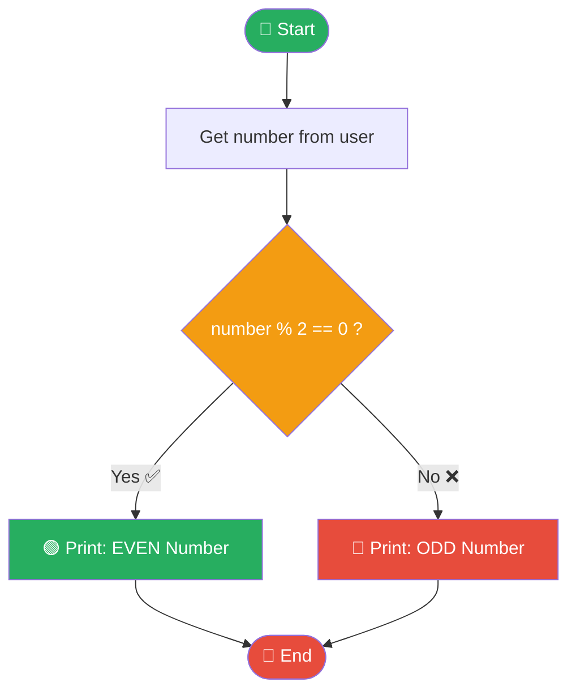

### 💻 Code

```python
# ── Odd or Even ──────────────────────────────────────────────
def check_odd_even(number):
    """Return 'Even' or 'Odd' for a given number."""
    if number % 2 == 0:
        return "Even"
    else:
        return "Odd"

# Test it
num = int(input("Enter a number: "))
result = check_odd_even(num)
print(f"{num} is an {result} number.")

# ── Check a whole list at once ────────────────────────────────
numbers = [1, 2, 3, 4, 5, 6, 7, 8, 9, 10]
for n in numbers:
    tag = "Even ✅" if n % 2 == 0 else "Odd  🔴"
    print(f"  {n:>3}  →  {tag}")
```

**Output:**
```
  1  →  Odd  🔴
  2  →  Even ✅
  3  →  Odd  🔴
  4  →  Even ✅
  ...
```

> 🔑 **Key Takeaway:** `%` (modulo) is the secret weapon. `n % 2` is always 0 or 1.

---

## 2. Sum of N Numbers

### 📖 Concept
Add all integers from **1 to N** using a loop, or use the mathematical formula.

```
┌──────────────────────────────────────────────────────────────┐
│   Sum of 1 to 5:                                            │
│                                                              │
│   Step 1:  total = 0                                        │
│   Step 2:  total = 0 + 1 = 1                               │
│   Step 3:  total = 1 + 2 = 3                               │
│   Step 4:  total = 3 + 3 = 6                               │
│   Step 5:  total = 6 + 4 = 10                              │
│   Step 6:  total = 10 + 5 = 15  ✅                         │
│                                                              │
│   Formula Shortcut:  n × (n + 1) / 2  =  5×6/2  =  15     │
└──────────────────────────────────────────────────────────────┘
```

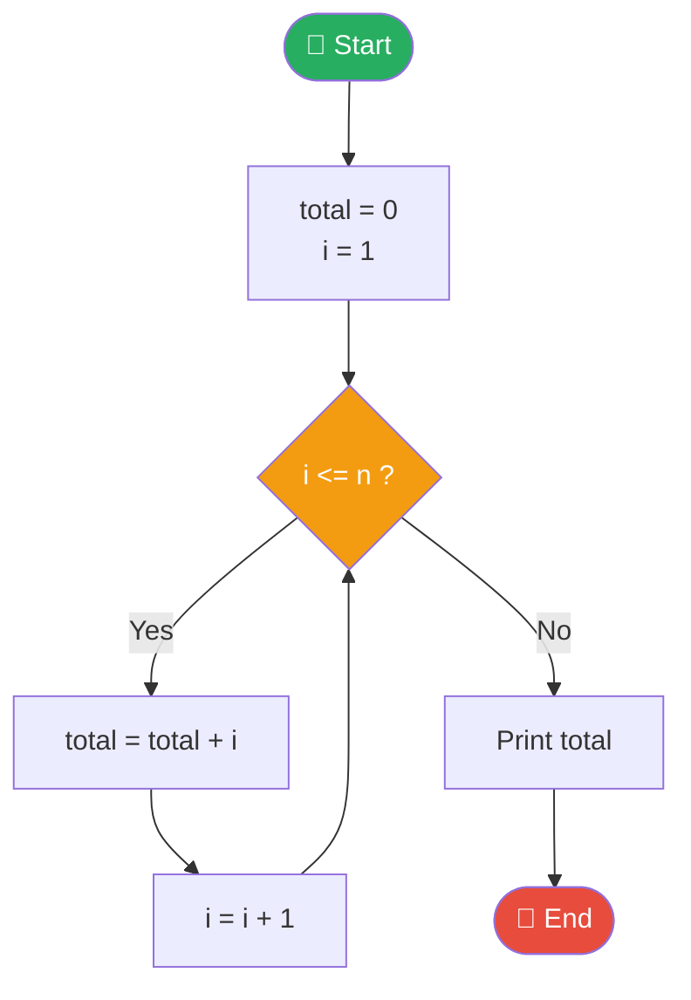

### 💻 Code

```python
# ── Method 1: Using a for loop ────────────────────────────────
def sum_loop(n):
    total = 0
    for i in range(1, n + 1):
        total += i          # same as: total = total + i
    return total

# ── Method 2: Using built-in sum() ───────────────────────────
def sum_builtin(n):
    return sum(range(1, n + 1))

# ── Method 3: Formula n*(n+1)/2 ──────────────────────────────
def sum_formula(n):
    return n * (n + 1) // 2

n = int(input("Enter N: "))
print(f"Sum 1 to {n}  [loop]    = {sum_loop(n)}")
print(f"Sum 1 to {n}  [builtin] = {sum_builtin(n)}")
print(f"Sum 1 to {n}  [formula] = {sum_formula(n)}")
```

**Output (N = 10):**
```
Sum 1 to 10  [loop]    = 55
Sum 1 to 10  [builtin] = 55
Sum 1 to 10  [formula] = 55
```

> 🔑 **Key Takeaway:** `+=` is shorthand for `total = total + i`. All three methods give the same answer.

---

## 3. Prime Number Check

### 📖 Concept
A **prime number** is a number greater than 1 that has **no divisors other than 1 and itself**.

```
┌───────────────────────────────────────────────────────────────┐
│                   PRIME vs NOT PRIME                         │
│                                                               │
│   2  → divisors: 1, 2          → PRIME   ✅                  │
│   3  → divisors: 1, 3          → PRIME   ✅                  │
│   4  → divisors: 1, 2, 4       → NOT PRIME ❌  (2×2=4)       │
│   7  → divisors: 1, 7          → PRIME   ✅                  │
│   9  → divisors: 1, 3, 9       → NOT PRIME ❌  (3×3=9)       │
│                                                               │
│   🚀 TRICK: Only check divisors up to √n                     │
│      If 13 has no divisors from 2 to √13 (≈3.6), it's prime │
└───────────────────────────────────────────────────────────────┘
```

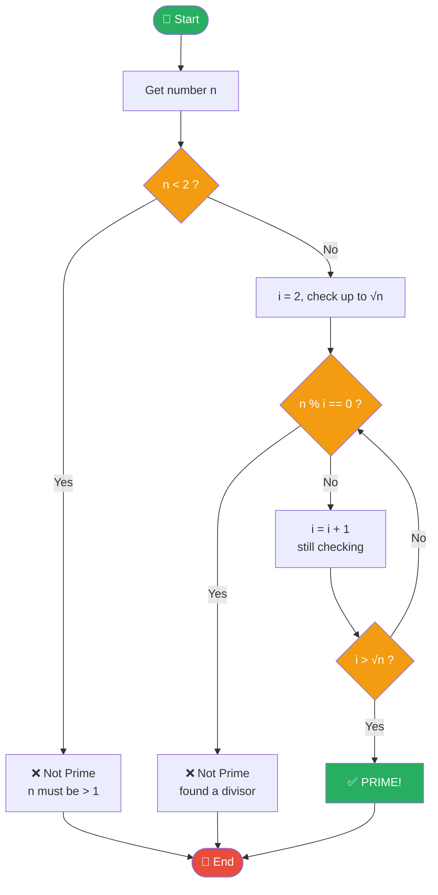

### 💻 Code

```python
import math

# ── Prime Check Function ──────────────────────────────────────
def is_prime(n):
    """Returns True if n is a prime number, False otherwise."""
    if n < 2:
        return False                  # 0 and 1 are not prime
    if n == 2:
        return True                   # 2 is the only even prime
    if n % 2 == 0:
        return False                  # skip all other even numbers

    # Check odd divisors only, up to √n
    for i in range(3, int(math.sqrt(n)) + 1, 2):
        if n % i == 0:
            return False              # found a divisor → not prime
    return True

# Test single number
num = int(input("Enter a number: "))
if is_prime(num):
    print(f"✅ {num} is a Prime number.")
else:
    print(f"❌ {num} is NOT a Prime number.")

# ── Print all primes from 1 to 50 ────────────────────────────
print("\nPrime numbers from 1 to 50:")
primes = [n for n in range(2, 51) if is_prime(n)]
print(primes)
```

**Output:**
```
✅ 17 is a Prime number.

Prime numbers from 1 to 50:
[2, 3, 5, 7, 11, 13, 17, 19, 23, 29, 31, 37, 41, 43, 47]
```

> 🔑 **Key Takeaway:** Only check divisors up to **√n** — this makes the check much faster.

---

## 4. Factorial of a Number

### 📖 Concept
The **factorial** of n (written n!) is the product of all positive integers from 1 to n.

```
┌──────────────────────────────────────────────────────────────┐
│                FACTORIAL EXAMPLES                           │
│                                                              │
│   0! = 1                    (by definition)                 │
│   1! = 1                                                     │
│   2! = 2 × 1           = 2                                  │
│   3! = 3 × 2 × 1       = 6                                  │
│   4! = 4 × 3 × 2 × 1   = 24                                 │
│   5! = 5 × 4 × 3 × 2 × 1 = 120                             │
│                                                              │
│   Pattern:  n! = n × (n-1)!   ← this is RECURSION!         │
└──────────────────────────────────────────────────────────────┘
```


### 💻 Code

```python
# ── Method 1: Iterative (using a loop) ───────────────────────
def factorial_loop(n):
    if n < 0:
        return "Undefined (negative numbers)"
    result = 1
    for i in range(1, n + 1):
        result *= i           # result = result × i
    return result

# ── Method 2: Recursive ───────────────────────────────────────
def factorial_recursive(n):
    if n == 0 or n == 1:      # base case — stop here
        return 1
    return n * factorial_recursive(n - 1)   # call itself!

# ── Method 3: Built-in math.factorial ────────────────────────
import math
def factorial_builtin(n):
    return math.factorial(n)

# Test
n = int(input("Enter a number: "))
print(f"{n}! = {factorial_loop(n)}")

# Show the working step by step
print(f"\nStep-by-step for {n}!:")
result = 1
for i in range(1, n + 1):
    result *= i
    steps = " × ".join(str(x) for x in range(1, i + 1))
    print(f"  {steps} = {result}")
```

**Output (n = 5):**
```
5! = 120

Step-by-step for 5!:
  1 = 1
  1 × 2 = 2
  1 × 2 × 3 = 6
  1 × 2 × 3 × 4 = 24
  1 × 2 × 3 × 4 × 5 = 120
```

> 🔑 **Key Takeaway:** `*=` means "multiply and assign". Recursion calls the function inside itself until it hits the base case.

---

## 5. Fibonacci Sequence

### 📖 Concept
Each number in the Fibonacci sequence is the **sum of the two numbers before it**.

```
┌──────────────────────────────────────────────────────────────┐
│                  FIBONACCI SEQUENCE                         │
│                                                              │
│   Position:  0   1   2   3   4   5   6   7   8   9         │
│   Value:     0   1   1   2   3   5   8  13  21  34         │
│                  ↑   ↑   ↑                                  │
│              0+1=1  1+1=2  1+2=3  2+3=5  3+5=8 ...        │
│                                                              │
│   RULE:  F(0) = 0,  F(1) = 1                               │
│          F(n) = F(n-1) + F(n-2)   for n > 1               │
└──────────────────────────────────────────────────────────────┘
```

```mermaid
flowchart LR
    A["F(0)=0"] -->|"+0"| B["F(1)=1"]
    B -->|"0+1"| C["F(2)=1"]
    C -->|"1+1"| D["F(3)=2"]
    D -->|"1+2"| E["F(4)=3"]
    E -->|"2+3"| F["F(5)=5"]
    F -->|"3+5"| G["F(6)=8"]
    G -->|"5+8"| H["F(7)=13"]

    style A fill:#E74C3C,color:#fff
    style B fill:#E67E22,color:#fff
    style C fill:#F1C40F,color:#000
    style D fill:#27AE60,color:#fff
    style E fill:#1ABC9C,color:#fff
    style F fill:#3498DB,color:#fff
    style G fill:#9B59B6,color:#fff
    style H fill:#2C3E50,color:#fff
```

### 💻 Code

```python
# ── Method 1: Print first N Fibonacci numbers ─────────────────
def fibonacci_sequence(n):
    """Print the Fibonacci sequence up to n terms."""
    a, b = 0, 1
    sequence = []
    for _ in range(n):
        sequence.append(a)
        a, b = b, a + b     # swap trick: update both at once!
    return sequence

# ── Method 2: Find Nth Fibonacci number ──────────────────────
def fibonacci_nth(n):
    """Return the nth Fibonacci number."""
    if n <= 0: return 0
    if n == 1: return 1
    a, b = 0, 1
    for _ in range(2, n + 1):
        a, b = b, a + b
    return b

# ── Method 3: Recursive ───────────────────────────────────────
def fib_recursive(n):
    if n <= 1:
        return n
    return fib_recursive(n - 1) + fib_recursive(n - 2)

# Test
n = int(input("How many Fibonacci numbers? "))
seq = fibonacci_sequence(n)
print(f"First {n} Fibonacci numbers:")
print(seq)

# Visual display
print("\nFibonacci Visual:")
for i, val in enumerate(seq):
    bar = "█" * (val if val <= 40 else 40)
    print(f"  F({i:>2}) = {val:>5}  {bar}")
```

**Output (n = 10):**
```
First 10 Fibonacci numbers:
[0, 1, 1, 2, 3, 5, 8, 13, 21, 34]

Fibonacci Visual:
  F( 0) =     0  
  F( 1) =     1  █
  F( 2) =     1  █
  F( 3) =     2  ██
  F( 4) =     3  ███
  F( 5) =     5  █████
  F( 6) =     8  ████████
  F( 7) =    13  █████████████
  F( 8) =    21  █████████████████████
  F( 9) =    34  ██████████████████████████████████
```

> 🔑 **Key Takeaway:** `a, b = b, a + b` is a Python trick to update two variables at once without a temporary variable.

---

## 6. Palindrome Check

### 📖 Concept
A **palindrome** reads the same forwards and backwards.

```
┌──────────────────────────────────────────────────────────────┐
│                  PALINDROME EXAMPLES                        │
│                                                              │
│   Words:    "radar"   →  r-a-d-a-r  ↔  r-a-d-a-r  ✅      │
│             "level"   →  l-e-v-e-l  ↔  l-e-v-e-l  ✅      │
│             "hello"   →  h-e-l-l-o  ↔  o-l-l-e-h  ❌      │
│                                                              │
│   Numbers:  121  →  forwards: 121  backwards: 121  ✅       │
│             123  →  forwards: 123  backwards: 321  ❌       │
│                                                              │
│   METHOD:  Reverse the string. If it equals the original   │
│            → it's a palindrome!                            │
└──────────────────────────────────────────────────────────────┘
```

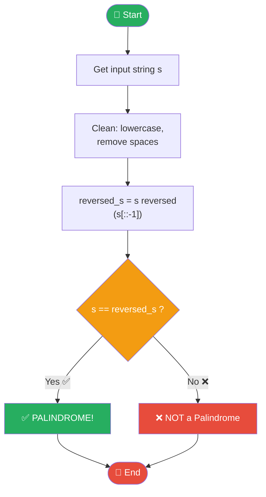

### 💻 Code

```python
# ── Method 1: Reverse and compare ────────────────────────────
def is_palindrome(text):
    """Check if a string is a palindrome."""
    cleaned = text.lower().replace(" ", "")   # case-insensitive
    return cleaned == cleaned[::-1]           # [::-1] reverses

# ── Method 2: Two-pointer approach ───────────────────────────
def is_palindrome_pointers(text):
    cleaned = text.lower().replace(" ", "")
    left, right = 0, len(cleaned) - 1
    while left < right:
        if cleaned[left] != cleaned[right]:
            return False
        left += 1
        right -= 1
    return True

# ── Number palindrome ─────────────────────────────────────────
def is_palindrome_number(n):
    s = str(n)
    return s == s[::-1]

# Test
words = ["radar", "level", "python", "madam", "hello", "racecar"]
print("Word Palindrome Check:")
print(f"{'Word':<12} {'Reversed':<12} {'Palindrome?'}")
print("-" * 36)
for word in words:
    rev = word[::-1]
    result = "✅ Yes" if is_palindrome(word) else "❌ No"
    print(f"{word:<12} {rev:<12} {result}")

print("\nNumber Palindrome Check:")
for n in [121, 123, 1331, 12321, 12345]:
    result = "✅ Yes" if is_palindrome_number(n) else "❌ No"
    print(f"  {n}  →  {result}")
```

**Output:**
```
Word Palindrome Check:
Word         Reversed     Palindrome?
------------------------------------
radar        radar        ✅ Yes
level        level        ✅ Yes
python       nohtyp       ❌ No
madam        madam        ✅ Yes
hello        olleh        ❌ No
racecar      racecar      ✅ Yes
```

> 🔑 **Key Takeaway:** `s[::-1]` reverses any string in Python. Clean the string first (lowercase, no spaces) for fair comparison.

---

## 7. Reverse a String

### 📖 Concept
Return a string with its characters in reverse order.

```
┌──────────────────────────────────────────────────────────────┐
│                   REVERSING "Python"                        │
│                                                              │
│   Original:   P  y  t  h  o  n                              │
│   Index:      0  1  2  3  4  5                              │
│                                                              │
│   Reversed:   n  o  h  t  y  P                              │
│   Index:      5  4  3  2  1  0   ← reading right to left   │
│                                                              │
│   s[::-1]  means: start from end, step -1 (go backwards)   │
└──────────────────────────────────────────────────────────────┘
```

### 💻 Code

```python
# ── Method 1: Slicing (Pythonic & fastest) ────────────────────
def reverse_slice(s):
    return s[::-1]

# ── Method 2: Loop ────────────────────────────────────────────
def reverse_loop(s):
    reversed_str = ""
    for char in s:
        reversed_str = char + reversed_str   # prepend each char
    return reversed_str

# ── Method 3: Built-in reversed() ────────────────────────────
def reverse_builtin(s):
    return "".join(reversed(s))

# Test all three
text = input("Enter a string: ")
print(f"\nOriginal  : {text}")
print(f"Slicing   : {reverse_slice(text)}")
print(f"Loop      : {reverse_loop(text)}")
print(f"Built-in  : {reverse_builtin(text)}")

# Show step-by-step how loop reversal works
print(f"\nStep-by-step loop reversal of '{text}':")
result = ""
for i, char in enumerate(text):
    result = char + result
    print(f"  Step {i+1}: add '{char}' → '{result}'")
```

**Output:**
```
Original  : Python
Slicing   : nohtyP
Loop      : nohtyP
Built-in  : nohtyP

Step-by-step loop reversal of 'Python':
  Step 1: add 'P' → 'P'
  Step 2: add 'y' → 'yP'
  Step 3: add 't' → 'tyP'
  Step 4: add 'h' → 'htyP'
  Step 5: add 'o' → 'ohtyP'
  Step 6: add 'n' → 'nohtyP'
```

---

## 8. Count Vowels in a String

### 📖 Concept
Count how many vowels (a, e, i, o, u) appear in a given string.

```
┌──────────────────────────────────────────────────────────────┐
│           COUNTING VOWELS IN "Hello World"                  │
│                                                              │
│   H  e  l  l  o     W  o  r  l  d                          │
│   ✗  ✅  ✗  ✗  ✅    ✗  ✅  ✗  ✗  ✗                        │
│                                                              │
│   Vowels found: e, o, o  →  Count = 3                      │
│   Vowels: a, e, i, o, u  (and A, E, I, O, U)               │
└──────────────────────────────────────────────────────────────┘
```

### 💻 Code

```python
# ── Method 1: Loop through and check ─────────────────────────
def count_vowels(text):
    vowels = "aeiouAEIOU"
    count = 0
    for char in text:
        if char in vowels:
            count += 1
    return count

# ── Method 2: Using sum() and a generator ─────────────────────
def count_vowels_sum(text):
    return sum(1 for char in text if char.lower() in "aeiou")

# ── Method 3: Also show WHICH vowels were found ───────────────
def analyze_vowels(text):
    vowels_found = {}
    for char in text.lower():
        if char in "aeiou":
            vowels_found[char] = vowels_found.get(char, 0) + 1
    return vowels_found

# Test
text = input("Enter a sentence: ")
total = count_vowels(text)
breakdown = analyze_vowels(text)

print(f"\nText       : '{text}'")
print(f"Total chars: {len(text)}")
print(f"Vowel count: {total}")
print(f"Consonants : {sum(1 for c in text if c.isalpha() and c.lower() not in 'aeiou')}")
print(f"\nVowel breakdown:")
for vowel, cnt in sorted(breakdown.items()):
    bar = "■" * cnt
    print(f"  '{vowel}' appears {cnt}x  {bar}")
```

**Output:**
```
Text       : 'Hello World'
Total chars: 11
Vowel count: 3

Vowel breakdown:
  'e' appears 1x  ■
  'o' appears 2x  ■■
```

---

## 9. Find Largest & Smallest in a List

### 📖 Concept
Scan through all numbers to find the biggest and the smallest.

```
┌──────────────────────────────────────────────────────────────┐
│          Finding MAX in [3, 7, 1, 9, 4, 6]                 │
│                                                              │
│  Start:  max_so_far = 3  (first element)                    │
│  Check 7:  7 > 3?  Yes  →  max_so_far = 7                  │
│  Check 1:  1 > 7?  No   →  max_so_far = 7                  │
│  Check 9:  9 > 7?  Yes  →  max_so_far = 9                  │
│  Check 4:  4 > 9?  No   →  max_so_far = 9                  │
│  Check 6:  6 > 9?  No   →  max_so_far = 9                  │
│                                                              │
│  Result:  MAX = 9  ✅                                        │
└──────────────────────────────────────────────────────────────┘
```

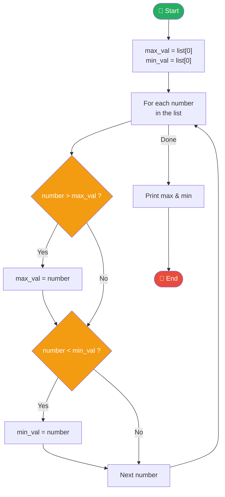

### 💻 Code

```python
# ── Method 1: Manual scan (understand the logic) ─────────────
def find_max_min_manual(numbers):
    if not numbers:
        return None, None
    max_val = numbers[0]
    min_val = numbers[0]
    for num in numbers[1:]:
        if num > max_val:
            max_val = num
        if num < min_val:
            min_val = num
    return max_val, min_val

# ── Method 2: Built-in functions ─────────────────────────────
def find_max_min_builtin(numbers):
    return max(numbers), min(numbers)

# Test
numbers = [34, 7, 23, 32, 5, 62, 12, 78, 45, 9]
max_v, min_v = find_max_min_manual(numbers)

print(f"List    : {numbers}")
print(f"Maximum : {max_v}")
print(f"Minimum : {min_v}")
print(f"Range   : {max_v - min_v}")
print(f"Average : {sum(numbers) / len(numbers):.2f}")
print(f"Sorted  : {sorted(numbers)}")

# Visual: show values as a bar chart
print("\nVisual Bar Chart:")
for n in numbers:
    bar = "█" * (n // 5)
    print(f"  {n:>4}  {bar}")
```

---

## 10. Armstrong Number

### 📖 Concept
An **Armstrong number** (narcissistic number) equals the sum of its digits each raised to the power of the number of digits.

```
┌──────────────────────────────────────────────────────────────┐
│                ARMSTRONG NUMBER CHECK                       │
│                                                              │
│   153  →  3 digits                                          │
│        →  1³ + 5³ + 3³                                      │
│        →  1 + 125 + 27                                      │
│        →  153  ✅  (equals original!)                       │
│                                                              │
│   371  →  3³ + 7³ + 1³ = 27 + 343 + 1 = 371  ✅           │
│   9474 →  9⁴ + 4⁴ + 7⁴ + 4⁴ = 9474  ✅                   │
│   123  →  1³ + 2³ + 3³ = 1+8+27 = 36  ≠ 123  ❌           │
└──────────────────────────────────────────────────────────────┘
```

### 💻 Code

```python
# ── Armstrong Number Check ────────────────────────────────────
def is_armstrong(n):
    digits = str(n)               # convert to string to get digits
    power = len(digits)           # number of digits
    total = sum(int(d) ** power for d in digits)
    return total == n

# Test a single number
num = int(input("Enter a number: "))
if is_armstrong(num):
    print(f"✅ {num} is an Armstrong number!")
else:
    print(f"❌ {num} is NOT an Armstrong number.")

# ── Find all Armstrong numbers up to 9999 ────────────────────
print("\nAll Armstrong numbers from 1 to 9999:")
armstrong_list = [n for n in range(1, 10000) if is_armstrong(n)]
print(armstrong_list)

# Show the calculation for each
print("\nProof:")
for n in armstrong_list:
    digits = str(n)
    p = len(digits)
    parts = " + ".join(f"{d}^{p}" for d in digits)
    calc = " + ".join(str(int(d)**p) for d in digits)
    print(f"  {n} = {parts} = {calc} = {sum(int(d)**p for d in digits)} ✅")
```

**Output:**
```
All Armstrong numbers from 1 to 9999:
[1, 2, 3, 4, 5, 6, 7, 8, 9, 153, 370, 371, 407, 1634, 8208, 9474]

Proof:
  153 = 1^3 + 5^3 + 3^3 = 1 + 125 + 27 = 153 ✅
  370 = 3^3 + 7^3 + 0^3 = 27 + 343 + 0 = 370 ✅
  371 = 3^3 + 7^3 + 1^3 = 27 + 343 + 1 = 371 ✅
```

---

## 11. Perfect Number

### 📖 Concept
A **perfect number** equals the sum of all its **proper divisors** (divisors excluding itself).

```
┌──────────────────────────────────────────────────────────────┐
│                 PERFECT NUMBER EXAMPLES                     │
│                                                              │
│   6  →  divisors: 1, 2, 3                                   │
│      →  1 + 2 + 3 = 6  ✅  (equals itself!)                │
│                                                              │
│   28 →  divisors: 1, 2, 4, 7, 14                           │
│      →  1+2+4+7+14 = 28  ✅                                 │
│                                                              │
│   12 →  divisors: 1, 2, 3, 4, 6                             │
│      →  1+2+3+4+6 = 16  ≠ 12  ❌                           │
└──────────────────────────────────────────────────────────────┘
```

### 💻 Code

```python
# ── Perfect Number Check ──────────────────────────────────────
def is_perfect(n):
    if n < 2:
        return False
    divisors = [i for i in range(1, n) if n % i == 0]
    return sum(divisors) == n

# Test
num = int(input("Enter a number: "))
if is_perfect(num):
    divisors = [i for i in range(1, num) if num % i == 0]
    print(f"✅ {num} is a Perfect number!")
    print(f"   Divisors: {divisors}")
    print(f"   Sum: {' + '.join(map(str, divisors))} = {sum(divisors)}")
else:
    print(f"❌ {num} is NOT a Perfect number.")

# Find all perfect numbers up to 10000
print("\nPerfect numbers up to 10000:")
for n in range(2, 10001):
    if is_perfect(n):
        divisors = [i for i in range(1, n) if n % i == 0]
        print(f"  {n}  (divisors: {divisors})")
```

---

## 12. Number Pattern Printing

### 📖 Concept
Use nested loops to print shapes and patterns with numbers or stars.

```
┌─────────────────────────────────────────────────────────┐
│              COMMON PATTERNS                            │
│                                                         │
│  Right Triangle   Square      Pyramid                  │
│  1                1 2 3 4 5     1                      │
│  1 2              1 2 3 4 5    1 2 1                   │
│  1 2 3            1 2 3 4 5   1 2 3 2 1               │
│  1 2 3 4          1 2 3 4 5  1 2 3 4 3 2 1            │
│  1 2 3 4 5        1 2 3 4 5 1 2 3 4 5 4 3 2 1         │
└─────────────────────────────────────────────────────────┘
```

### 💻 Code

```python
n = 5   # number of rows

# ── Pattern 1: Right Triangle ─────────────────────────────────
print("Pattern 1: Right Triangle")
for i in range(1, n + 1):
    print(" ".join(str(j) for j in range(1, i + 1)))

# ── Pattern 2: Inverted Triangle ─────────────────────────────
print("\nPattern 2: Inverted Triangle")
for i in range(n, 0, -1):
    print(" ".join(str(j) for j in range(1, i + 1)))

# ── Pattern 3: Star Pyramid ───────────────────────────────────
print("\nPattern 3: Star Pyramid")
for i in range(1, n + 1):
    spaces = " " * (n - i)
    stars  = "* " * i
    print(spaces + stars)

# ── Pattern 4: Diamond ───────────────────────────────────────
print("\nPattern 4: Diamond")
for i in range(1, n + 1):
    print(" " * (n - i) + "* " * i)
for i in range(n - 1, 0, -1):
    print(" " * (n - i) + "* " * i)

# ── Pattern 5: Multiplication Table ──────────────────────────
print("\nPattern 5: Multiplication Table (5x5)")
for i in range(1, 6):
    for j in range(1, 6):
        print(f"{i * j:>4}", end="")
    print()
```

**Output:**
```
Pattern 1: Right Triangle
1
1 2
1 2 3
1 2 3 4
1 2 3 4 5

Pattern 3: Star Pyramid
    * 
   * * 
  * * * 
 * * * * 
* * * * * 

Pattern 5: Multiplication Table (5x5)
   1   2   3   4   5
   2   4   6   8  10
   3   6   9  12  15
   4   8  12  16  20
   5  10  15  20  25
```

---

## 13. FizzBuzz

### 📖 Concept
The classic coding interview warm-up! For numbers 1–N: print **Fizz** if divisible by 3, **Buzz** if divisible by 5, **FizzBuzz** if divisible by both, otherwise print the number.

```
┌──────────────────────────────────────────────────────────────┐
│                    FIZZBUZZ RULES                           │
│                                                              │
│   Number divisible by 3 AND 5  →  "FizzBuzz"               │
│   Number divisible by 3 only   →  "Fizz"                   │
│   Number divisible by 5 only   →  "Buzz"                   │
│   Everything else              →  the number itself        │
│                                                              │
│   1→1  2→2  3→Fizz  4→4  5→Buzz  6→Fizz  7→7              │
│   8→8  9→Fizz  10→Buzz  11→11  12→Fizz  13→13             │
│   14→14  15→FizzBuzz  16→16 ...                            │
└──────────────────────────────────────────────────────────────┘
```

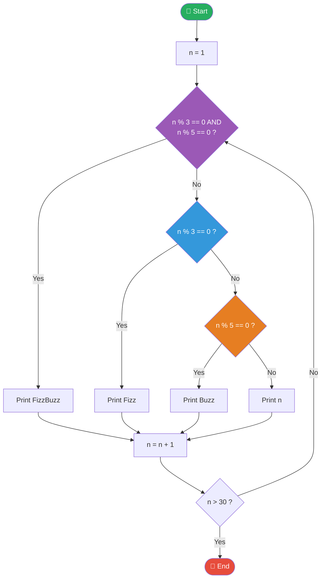

### 💻 Code

```python
# ── FizzBuzz ──────────────────────────────────────────────────
def fizzbuzz(n):
    """Return FizzBuzz result for a single number."""
    if n % 15 == 0:       # divisible by both 3 and 5
        return "FizzBuzz"
    elif n % 3 == 0:
        return "Fizz"
    elif n % 5 == 0:
        return "Buzz"
    else:
        return str(n)

# Print FizzBuzz for 1 to 30
print("FizzBuzz (1 to 30):\n")
for i in range(1, 31):
    result = fizzbuzz(i)
    tag = ""
    if "Fizz" in result and "Buzz" in result:
        tag = " 🟣"
    elif "Fizz" in result:
        tag = " 🔵"
    elif "Buzz" in result:
        tag = " 🟡"
    print(f"  {i:>3} → {result:<10}{tag}")
```

**Output:**
```
  1 → 1         
  2 → 2         
  3 → Fizz       🔵
  4 → 4         
  5 → Buzz       🟡
  6 → Fizz       🔵
  ...
 15 → FizzBuzz   🟣
```

---

## 14. Linear Search

### 📖 Concept
**Linear search** checks each element one by one from the beginning until the target is found (or the list ends).

```
┌──────────────────────────────────────────────────────────────┐
│         LINEAR SEARCH for 7 in [3, 8, 2, 7, 5, 9]         │
│                                                              │
│  Step 1: Check index 0 → value 3  →  3 == 7?  No  ➡️      │
│  Step 2: Check index 1 → value 8  →  8 == 7?  No  ➡️      │
│  Step 3: Check index 2 → value 2  →  2 == 7?  No  ➡️      │
│  Step 4: Check index 3 → value 7  →  7 == 7?  YES ✅       │
│                                                              │
│  ✅ Found at index 3!                                        │
│  ⏱️ Checked 4 elements out of 6                            │
└──────────────────────────────────────────────────────────────┘
```

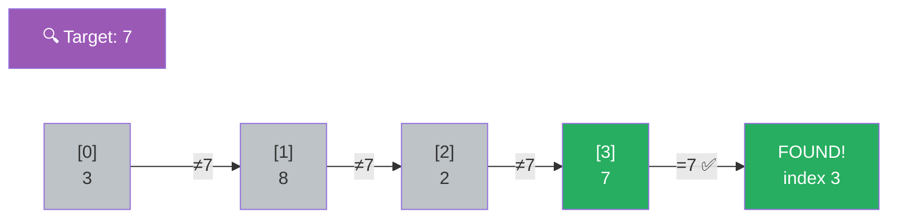

### 💻 Code

```python
# ── Linear Search ─────────────────────────────────────────────
def linear_search(arr, target):
    """
    Search for target in arr.
    Returns index if found, -1 if not found.
    """
    steps = 0
    for i in range(len(arr)):
        steps += 1
        print(f"  Step {steps}: checking index {i} → value {arr[i]}", end="")
        if arr[i] == target:
            print(f"  ✅ FOUND!")
            return i, steps
        print(f"  ✗ not a match")
    return -1, steps

# Test
numbers = [64, 25, 12, 22, 11, 90, 45, 33]
target = int(input("Enter number to search: "))

print(f"\nSearching for {target} in {numbers}:\n")
index, steps = linear_search(numbers, target)

if index != -1:
    print(f"\n✅ Found {target} at index {index}!")
    print(f"   Took {steps} step(s) out of {len(numbers)} elements.")
else:
    print(f"\n❌ {target} not found in the list.")
    print(f"   Checked all {steps} elements.")
```

> 🔑 **Key Takeaway:** Linear Search is simple but slow for large lists. In the worst case, it checks every single element. Time complexity: **O(n)**.

---

## 15. Binary Search

### 📖 Concept
**Binary search** works on a **sorted list**. It repeatedly cuts the search space in half — much faster than linear search!

```
┌──────────────────────────────────────────────────────────────┐
│      BINARY SEARCH for 33 in [2, 5, 8, 12, 16, 23, 38, 56] │
│                                                              │
│  List:  [2, 5, 8, 12, 16, 23, 38, 56]                      │
│  Index:  0  1  2   3   4   5   6   7                        │
│                                                              │
│  Round 1: low=0, high=7, mid=3 → arr[3]=12                 │
│           12 < 33  →  search RIGHT half                     │
│                                                              │
│  Round 2: low=4, high=7, mid=5 → arr[5]=23                 │
│           23 < 33  →  search RIGHT half                     │
│                                                              │
│  Round 3: low=6, high=7, mid=6 → arr[6]=38                 │
│           38 > 33  →  search LEFT half                      │
│                                                              │
│  Round 4: low=6, high=5 → low > high → NOT FOUND ❌        │
└──────────────────────────────────────────────────────────────┘
```

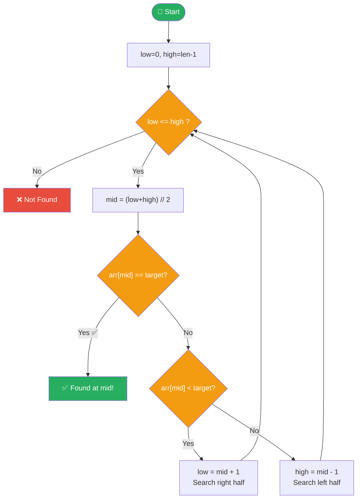

### 💻 Code

```python
# ── Binary Search ─────────────────────────────────────────────
def binary_search(arr, target):
    """
    Searches sorted arr for target.
    Returns (index, steps) — index is -1 if not found.
    """
    low, high = 0, len(arr) - 1
    steps = 0

    while low <= high:
        steps += 1
        mid = (low + high) // 2
        print(f"  Step {steps}: low={low}, high={high}, mid={mid} → arr[mid]={arr[mid]}", end="")

        if arr[mid] == target:
            print(f"  ✅ MATCH!")
            return mid, steps
        elif arr[mid] < target:
            print(f"  → go RIGHT")
            low = mid + 1
        else:
            print(f"  → go LEFT")
            high = mid - 1

    return -1, steps

# Test — list MUST be sorted!
numbers = sorted([64, 25, 12, 22, 11, 90, 45, 33, 78, 55])
print(f"Sorted list: {numbers}\n")
target = int(input("Enter number to search: "))

index, steps = binary_search(numbers, target)
if index != -1:
    print(f"\n✅ Found {target} at index {index}!")
else:
    print(f"\n❌ {target} not found.")
print(f"   Binary Search took only {steps} step(s)!")
print(f"   Linear would take up to {len(numbers)} step(s).")
```

> 🔑 **Key Takeaway:** Binary search is **dramatically faster**. For 1 million items, linear search takes up to 1,000,000 steps; binary search takes only ~20 steps. Requires the list to be **sorted** first.

---

## 16. Bubble Sort

### 📖 Concept
**Bubble sort** repeatedly compares adjacent elements and swaps them if they're in the wrong order — larger values "bubble up" to the end like bubbles rising in water.

```
┌──────────────────────────────────────────────────────────────┐
│        BUBBLE SORT: [5, 3, 8, 1, 4]                        │
│                                                              │
│  Pass 1:  [5,3] swap→ [3,5,8,1,4]                         │
│           [5,8] ok  → [3,5,8,1,4]                         │
│           [8,1] swap→ [3,5,1,8,4]                         │
│           [8,4] swap→ [3,5,1,4,8] ← 8 bubbled to end!     │
│                                                              │
│  Pass 2:  [3,5] ok  → [3,5,1,4,8]                         │
│           [5,1] swap→ [3,1,5,4,8]                         │
│           [5,4] swap→ [3,1,4,5,8] ← 5 in place!           │
│  ...continues until fully sorted...                         │
└──────────────────────────────────────────────────────────────┘
```

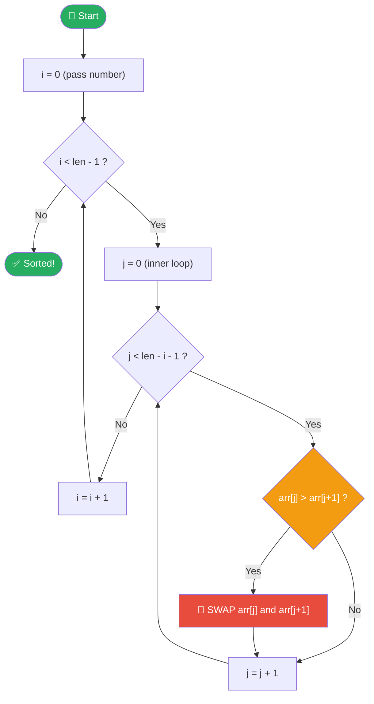

### 💻 Code

```python
# ── Bubble Sort ───────────────────────────────────────────────
def bubble_sort(arr):
    arr = arr.copy()       # don't modify the original
    n = len(arr)
    total_swaps = 0

    for i in range(n - 1):
        swapped = False
        for j in range(n - i - 1):
            if arr[j] > arr[j + 1]:
                arr[j], arr[j + 1] = arr[j + 1], arr[j]   # swap!
                total_swaps += 1
                swapped = True
        print(f"  After pass {i+1}: {arr}")
        if not swapped:        # if no swaps, already sorted!
            print("  (Early exit — list is already sorted!)")
            break
    print(f"\nTotal swaps: {total_swaps}")
    return arr

# Test
numbers = [64, 34, 25, 12, 22, 11, 90]
print(f"Original : {numbers}")
print(f"\nSorting step-by-step:")
sorted_list = bubble_sort(numbers)
print(f"\nSorted   : {sorted_list}")
```

**Output:**
```
Original : [64, 34, 25, 12, 22, 11, 90]

Sorting step-by-step:
  After pass 1: [34, 25, 12, 22, 11, 64, 90]
  After pass 2: [25, 12, 22, 11, 34, 64, 90]
  After pass 3: [12, 22, 11, 25, 34, 64, 90]
  After pass 4: [12, 11, 22, 25, 34, 64, 90]
  After pass 5: [11, 12, 22, 25, 34, 64, 90]

Total swaps: 11

Sorted   : [11, 12, 22, 25, 34, 64, 90]
```

> 🔑 **Key Takeaway:** `a, b = b, a` is Python's elegant way to swap two variables without a temporary variable.

---

## 17. Selection Sort

### 📖 Concept
**Selection sort** repeatedly **finds the minimum** element from the unsorted portion and places it at the beginning.

```
┌──────────────────────────────────────────────────────────────┐
│       SELECTION SORT: [29, 10, 14, 37, 13]                 │
│                                                              │
│  Pass 1: Find min in [29,10,14,37,13] → 10 at idx 1        │
│          Swap with index 0 → [10, 29, 14, 37, 13]          │
│                               ✅                            │
│  Pass 2: Find min in [29,14,37,13] → 13 at idx 4           │
│          Swap with index 1 → [10, 13, 14, 37, 29]          │
│                                   ✅                        │
│  Pass 3: Find min in [14,37,29] → 14 at idx 2 (already!)   │
│          No swap needed → [10, 13, 14, 37, 29]             │
│  ...                                                        │
└──────────────────────────────────────────────────────────────┘
```

### 💻 Code

```python
# ── Selection Sort ────────────────────────────────────────────
def selection_sort(arr):
    arr = arr.copy()
    n = len(arr)

    for i in range(n):
        # Find the minimum element in remaining unsorted array
        min_idx = i
        for j in range(i + 1, n):
            if arr[j] < arr[min_idx]:
                min_idx = j

        # Swap only if needed
        if min_idx != i:
            arr[i], arr[min_idx] = arr[min_idx], arr[i]
            print(f"  Pass {i+1}: Swapped {arr[min_idx]} ↔ {arr[i]}  → {arr}")
        else:
            print(f"  Pass {i+1}: No swap needed              → {arr}")

    return arr

# Test
numbers = [29, 10, 14, 37, 13]
print(f"Original : {numbers}\n")
sorted_numbers = selection_sort(numbers)
print(f"\nSorted   : {sorted_numbers}")
```

### Bubble Sort vs Selection Sort

```
┌─────────────────────┬────────────────────────┬──────────────────────────┐
│                     │    Bubble Sort         │    Selection Sort        │
├─────────────────────┼────────────────────────┼──────────────────────────┤
│ Strategy            │ Swap adjacent pairs    │ Find min, place at front │
│ Swaps per pass      │ Many possible          │ At most 1                │
│ Best for learning   │ ✅ Very intuitive      │ ✅ Easy to visualize      │
│ Stable sort         │ ✅ Yes                 │ ❌ No                     │
│ Time complexity     │ O(n²)                 │ O(n²)                    │
└─────────────────────┴────────────────────────┴──────────────────────────┘
```

---

## 18. Anagram Check

### 📖 Concept
Two words are **anagrams** if they contain the same letters in the same quantities (order doesn't matter).

```
┌──────────────────────────────────────────────────────────────┐
│                  ANAGRAM EXAMPLES                           │
│                                                              │
│   "listen"  ↔  "silent"   → same letters → ANAGRAM ✅      │
│   "triangle" ↔ "integral" → same letters → ANAGRAM ✅      │
│   "hello"   ↔  "world"    → different    → NOT anagram ❌  │
│                                                              │
│   METHOD: Sort both strings → if equal → anagram!          │
│   "listen" sorted → "eilnst"                                │
│   "silent" sorted → "eilnst"   ← same! ✅                  │
└──────────────────────────────────────────────────────────────┘
```

### 💻 Code

```python
# ── Method 1: Sort and compare ────────────────────────────────
def is_anagram_sort(s1, s2):
    s1 = s1.lower().replace(" ", "")
    s2 = s2.lower().replace(" ", "")
    return sorted(s1) == sorted(s2)

# ── Method 2: Count character frequencies ────────────────────
def is_anagram_count(s1, s2):
    s1 = s1.lower().replace(" ", "")
    s2 = s2.lower().replace(" ", "")
    if len(s1) != len(s2):
        return False
    freq = {}
    for char in s1:
        freq[char] = freq.get(char, 0) + 1
    for char in s2:
        freq[char] = freq.get(char, 0) - 1
    return all(v == 0 for v in freq.values())

# Test
pairs = [
    ("listen", "silent"),
    ("triangle", "integral"),
    ("hello", "world"),
    ("Astronomer", "Moon starer"),
    ("python", "typhon")
]

print(f"{'Word 1':<15} {'Word 2':<15} {'Anagram?'}")
print("-" * 42)
for w1, w2 in pairs:
    result = "✅ YES" if is_anagram_sort(w1, w2) else "❌ NO "
    print(f"{w1:<15} {w2:<15} {result}")
```

**Output:**
```
Word 1          Word 2          Anagram?
------------------------------------------
listen          silent          ✅ YES
triangle        integral        ✅ YES
hello           world           ❌ NO
Astronomer      Moon starer     ✅ YES
python          typhon          ✅ YES
```

---

## 19. GCD & LCM

### 📖 Concept
- **GCD** (Greatest Common Divisor) — the largest number that divides both numbers evenly.
- **LCM** (Least Common Multiple) — the smallest number that is a multiple of both numbers.

```
┌──────────────────────────────────────────────────────────────┐
│              GCD and LCM of 12 and 18                      │
│                                                              │
│  Divisors of 12: 1, 2, 3, 4, 6, 12                         │
│  Divisors of 18: 1, 2, 3, 6, 9, 18                         │
│  Common:         1, 2, 3, 6                                 │
│  GCD = 6  (largest common divisor)                         │
│                                                              │
│  Multiples of 12: 12, 24, 36, 48, 60, 72 ...              │
│  Multiples of 18: 18, 36, 54, 72, 90 ...                   │
│  LCM = 36  (smallest common multiple)                      │
│                                                              │
│  SHORTCUT:  LCM(a, b) = (a × b) / GCD(a, b)               │
└──────────────────────────────────────────────────────────────┘
```

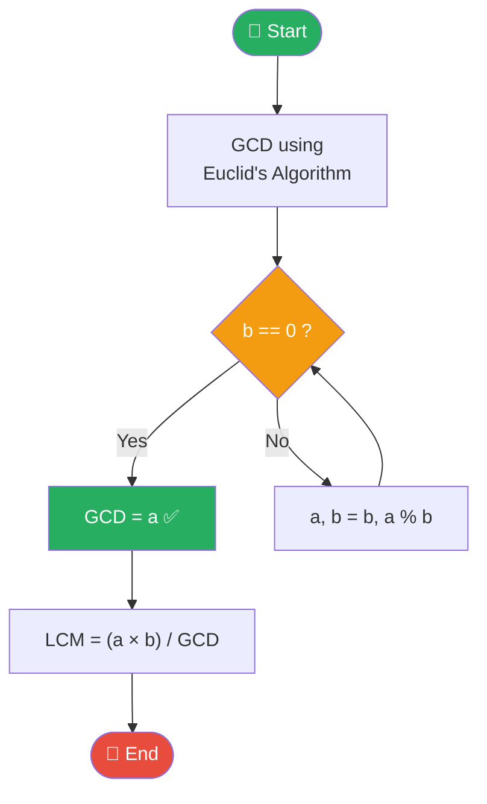

### 💻 Code

```python
# ── GCD using Euclid's Algorithm ──────────────────────────────
def gcd(a, b):
    """Euclid's algorithm: keep replacing (a,b) with (b, a%b)."""
    print(f"  GCD steps: ({a}, {b})", end="")
    while b != 0:
        a, b = b, a % b
        print(f" → ({a}, {b})", end="")
    print(f"  →  GCD = {a}")
    return a

# ── LCM using GCD ─────────────────────────────────────────────
def lcm(a, b):
    return abs(a * b) // gcd(a, b)

# ── Using Python's built-in math module ──────────────────────
import math

# Test
a = int(input("Enter first number: "))
b = int(input("Enter second number: "))

print(f"\nCalculating GCD of {a} and {b}:")
g = gcd(a, b)
l = lcm(a, b)

print(f"\nGCD({a}, {b}) = {g}")
print(f"LCM({a}, {b}) = {l}")
print(f"\nVerification using math module:")
print(f"  math.gcd({a}, {b}) = {math.gcd(a, b)}")
print(f"  math.lcm({a}, {b}) = {math.lcm(a, b)}")
```

**Output (a=12, b=18):**
```
Calculating GCD of 12 and 18:
  GCD steps: (12, 18) → (18, 12) → (12, 6) → (6, 0)  →  GCD = 6

GCD(12, 18) = 6
LCM(12, 18) = 36
```

---

## 20. Caesar Cipher (Encryption)

### 📖 Concept
The **Caesar Cipher** is one of the oldest encryption techniques. Each letter is shifted by a fixed number of positions in the alphabet.

```
┌──────────────────────────────────────────────────────────────┐
│             CAESAR CIPHER  (shift = 3)                     │
│                                                              │
│  Plain:   A B C D E F G H I J K L M N O P Q R S T U V W X Y Z
│  Cipher:  D E F G H I J K L M N O P Q R S T U V W X Y Z A B C
│                                                              │
│  "HELLO"  →  H+3=K, E+3=H, L+3=O, L+3=O, O+3=R            │
│           →  "KHOOR"  🔒                                     │
│                                                              │
│  Decrypt: reverse the shift (shift by -3)                   │
│  "KHOOR"  →  K-3=H, H-3=E, O-3=L, O-3=L, R-3=O            │
│           →  "HELLO"  🔓                                     │
└──────────────────────────────────────────────────────────────┘
```

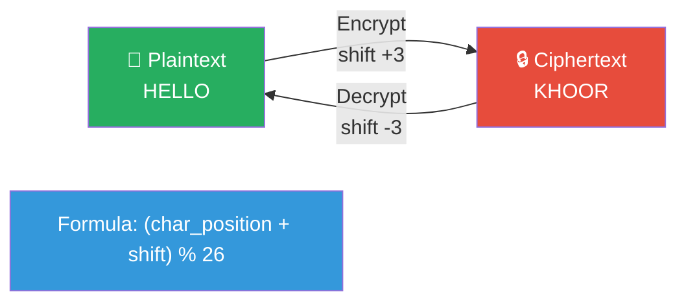

### 💻 Code

```python
# ── Caesar Cipher Encrypt / Decrypt ───────────────────────────
def caesar_cipher(text, shift, mode="encrypt"):
    """
    Encrypt or decrypt text using Caesar Cipher.
    mode: 'encrypt' or 'decrypt'
    """
    if mode == "decrypt":
        shift = -shift      # reverse the shift to decrypt

    result = ""
    for char in text:
        if char.isalpha():                      # only shift letters
            base = ord('A') if char.isupper() else ord('a')
            # Shift the character, wrap around using modulo 26
            shifted = (ord(char) - base + shift) % 26 + base
            result += chr(shifted)
        else:
            result += char                      # keep spaces, digits as-is
    return result

# Test
message = input("Enter a message: ")
shift   = int(input("Enter shift (1-25): "))

encrypted = caesar_cipher(message, shift, "encrypt")
decrypted = caesar_cipher(encrypted, shift, "decrypt")

print(f"\n{'─'*45}")
print(f"  Original  : {message}")
print(f"  Shift     : {shift}")
print(f"  Encrypted : {encrypted}  🔒")
print(f"  Decrypted : {decrypted}  🔓")
print(f"{'─'*45}")

# Show the alphabet shift table
print(f"\nAlphabet shift table (shift={shift}):")
import string
plain  = string.ascii_uppercase
cipher = plain[shift:] + plain[:shift]
print(f"  Plain : {' '.join(plain)}")
print(f"  Cipher: {' '.join(cipher)}")
```

**Output (message="Hello World", shift=3):**
```
─────────────────────────────────────────────
  Original  : Hello World
  Shift     : 3
  Encrypted : Khoor Zruog  🔒
  Decrypted : Hello World  🔓
─────────────────────────────────────────────
```

---

## 🗺️ Problem-Solving Roadmap

```mermaid
graph TD
    START([🌱 Start Here]) --> A

    A[🟢 Odd / Even] --> B[🟢 Sum of N Numbers]
    B --> C[🟢 Reverse String]
    C --> D[🟢 Count Vowels]
    D --> E[🟢 Largest & Smallest]

    E --> F[🟡 Prime Number]
    F --> G[🟡 Factorial]
    G --> H[🟡 Fibonacci]
    H --> I[🟡 Palindrome]
    I --> J[🟡 Armstrong Number]
    J --> K[🟡 Perfect Number]
    K --> L[🟡 FizzBuzz]
    L --> M[🟡 GCD & LCM]
    M --> N[🟡 Anagram Check]

    N --> O[🟠 Linear Search]
    O --> P[🟠 Binary Search]
    P --> Q[🟠 Bubble Sort]
    Q --> R[🟠 Selection Sort]
    R --> S[🟠 Caesar Cipher]
    S --> T[🟠 Pattern Printing]

    T --> NEXT([🚀 Next Level!\nData Structures & Algorithms])

    style START fill:#27AE60,color:#fff
    style NEXT fill:#9B59B6,color:#fff
    style A fill:#27AE60,color:#fff
    style B fill:#27AE60,color:#fff
    style C fill:#27AE60,color:#fff
    style D fill:#27AE60,color:#fff
    style E fill:#27AE60,color:#fff
    style F fill:#F39C12,color:#fff
    style G fill:#F39C12,color:#fff
    style H fill:#F39C12,color:#fff
    style I fill:#F39C12,color:#fff
    style J fill:#F39C12,color:#fff
    style K fill:#F39C12,color:#fff
    style L fill:#F39C12,color:#fff
    style M fill:#F39C12,color:#fff
    style N fill:#F39C12,color:#fff
    style O fill:#E74C3C,color:#fff
    style P fill:#E74C3C,color:#fff
    style Q fill:#E74C3C,color:#fff
    style R fill:#E74C3C,color:#fff
    style S fill:#E74C3C,color:#fff
    style T fill:#E74C3C,color:#fff
```

---

## 📊 Algorithm Complexity Quick Reference

```
┌──────────────────────┬────────────────┬──────────────────────────────────┐
│  Problem             │  Complexity    │  What it means                   │
├──────────────────────┼────────────────┼──────────────────────────────────┤
│  Odd / Even          │  O(1)          │  Instant — 1 operation           │
│  Sum of N            │  O(n)          │  Grows with N                    │
│  Prime Check         │  O(√n)         │  Square root — fast!             │
│  Factorial           │  O(n)          │  N multiplications               │
│  Fibonacci           │  O(n)          │  N additions                     │
│  Palindrome          │  O(n)          │  Check each character            │
│  Linear Search       │  O(n)          │  Check each element              │
│  Binary Search       │  O(log n)      │  Halves the search each time     │
│  Bubble Sort         │  O(n²)         │  Nested loops — slower           │
│  Selection Sort      │  O(n²)         │  Nested loops — slower           │
│  Python's sort()     │  O(n log n)    │  Best general-purpose sort       │
└──────────────────────┴────────────────┴──────────────────────────────────┘
```

---

## 💡 Problem-Solving Tips for Beginners

```
┌─────────────────────────────────────────────────────────────┐
│              GOLDEN RULES FOR PROBLEM SOLVING               │
│                                                             │
│  1️⃣  UNDERSTAND first — read the problem twice             │
│  2️⃣  Write the logic in plain English before coding        │
│  3️⃣  Draw a flowchart or trace on paper                    │
│  4️⃣  Start with a simple example (small input)             │
│  5️⃣  Test edge cases: 0, 1, negative, empty list           │
│  6️⃣  Add print() statements to debug step by step          │
│  7️⃣  Don't memorize — understand the PATTERN               │
│  8️⃣  Solve the same problem 3 different ways               │
│  9️⃣  Explain your solution out loud (Rubber Duck Debug)     │
│  🔟  Practice daily — even one problem a day compounds!     │
└─────────────────────────────────────────────────────────────┘
```

---

## 🏋️ Practice Challenges

| Challenge | Hint |
|-----------|------|
| Print all perfect numbers from 1 to 1000 | Use `is_perfect()` in a loop |
| Find all prime numbers between two values | Use `is_prime()` with a range |
| Sort a list without using built-in sort | Implement bubble or selection sort |
| Check if a sentence is a palindrome | Remove spaces, ignore case |
| Encrypt a message with Caesar Cipher and decrypt it | Use shift = 13 (ROT13) |
| Find the Fibonacci number at position N recursively | Base cases: F(0)=0, F(1)=1 |
| Count how many numbers in a list are Armstrong numbers | Combine loop with `is_armstrong()` |
| Search for a name in a sorted list using Binary Search | Convert to a list of names |

---

*Happy Coding! 🐍✨ — Every expert was once a beginner. Keep solving, keep growing!*
