# 🐍 Python Programming for Absolute Beginners
### A Complete Visual Guide with Code Examples & Diagrams

> **Who is this for?** Anyone who has never coded before. We start from zero and build up step by step.

---

## 📚 Table of Contents

1. [What is Python?](#1-what-is-python)
2. [Variables & Data Types](#2-variables--data-types)
3. [String Operations](#3-string-operations)
4. [Numbers & Math](#4-numbers--math)
5. [Getting Input from Users](#5-getting-input-from-users)
6. [Conditional Statements (if/elif/else)](#6-conditional-statements-ifelifelse)
7. [Lists](#7-lists)
8. [Tuples](#8-tuples)
9. [Dictionaries](#9-dictionaries)
10. [Loops — for loop](#10-loops--for-loop)
11. [Loops — while loop](#11-loops--while-loop)
12. [Functions](#12-functions)
13. [Scope: Local vs Global Variables](#13-scope-local-vs-global-variables)
14. [Error Handling (try/except)](#14-error-handling-tryexcept)
15. [File Handling](#15-file-handling)
16. [List Comprehensions](#16-list-comprehensions)
17. [Modules & Importing](#17-modules--importing)
18. [Classes & Objects (OOP Basics)](#18-classes--objects-oop-basics)
19. [Lambda Functions](#19-lambda-functions)
20. [Common Built-in Functions](#20-common-built-in-functions)

---

## 1. What is Python?

Python is a **beginner-friendly, general-purpose programming language** used in web development, data science, AI, automation, and more.

```
┌─────────────────────────────────────────────────────┐
│                  WHY PYTHON?                        │
│                                                     │
│  ✅ Easy to read (almost like English)              │
│  ✅ Huge community & tons of resources              │
│  ✅ Used by Google, NASA, Netflix, Instagram        │
│  ✅ Free and open source                            │
│  ✅ Works on Windows, Mac, Linux                    │
└─────────────────────────────────────────────────────┘
```

### Your First Python Program

```python
# This is a comment — Python ignores it
# The hash symbol (#) marks the start of a comment

print("Hello, World!")   # Output: Hello, World!
print("Welcome to Python!")
```

**Output:**
```
Hello, World!
Welcome to Python!
```

### How Python Executes Code

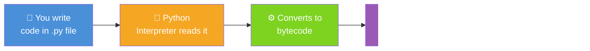

---

## 2. Variables & Data Types

A **variable** is a named box that stores a value in memory.

```
┌─────────────────────────────────────────────────────────────┐
│                   VARIABLE = A LABELED BOX                  │
│                                                             │
│   name = "Alice"     ┌──────────┐                          │
│                       │  "Alice" │ ← value stored inside    │
│                       └──────────┘                          │
│                          name  ← label on the box           │
└─────────────────────────────────────────────────────────────┘
```

### The 4 Core Data Types

```
┌──────────────┬────────────────────────┬───────────────────┐
│   TYPE       │   WHAT IT STORES       │   EXAMPLE         │
├──────────────┼────────────────────────┼───────────────────┤
│  int         │  Whole numbers         │  42, -7, 0        │
│  float       │  Decimal numbers       │  3.14, -0.5       │
│  str         │  Text (string)         │  "Hello", 'World' │
│  bool        │  True or False only    │  True, False      │
└──────────────┴────────────────────────┴───────────────────┘
```

```python
# Integer — whole numbers
age = 25
year = 2024
temperature = -10

# Float — numbers with decimals
price = 9.99
pi = 3.14159
weight = 65.5

# String — text in quotes
name = "Alice"
city = 'Chennai'
greeting = "Hello, World!"

# Boolean — only True or False
is_student = True
has_license = False

# Check the type of any variable
print(type(age))        # <class 'int'>
print(type(price))      # <class 'float'>
print(type(name))       # <class 'str'>
print(type(is_student)) # <class 'bool'>
```

### Data Type Conversion

```python
# Convert between types
number_str = "42"
number_int = int(number_str)    # "42" → 42
number_float = float(number_str) # "42" → 42.0

age = 25
age_str = str(age)              # 25 → "25"

print(type(number_int))   # <class 'int'>
print(type(age_str))      # <class 'str'>
```

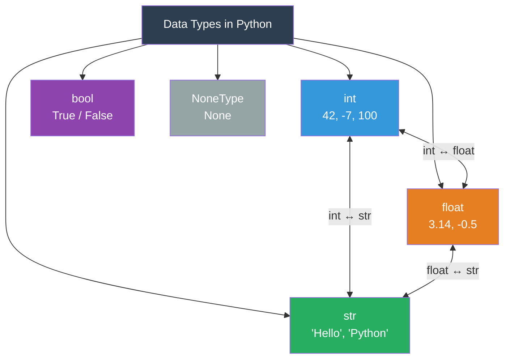

---

## 3. String Operations

Strings are sequences of characters enclosed in quotes.

```python
# Creating strings
single = 'Hello'
double = "World"
multi_line = """This is
a multi-line
string"""

# String concatenation (joining)
first = "Hello"
second = "World"
combined = first + " " + second
print(combined)   # Hello World

# String repetition
line = "-" * 20
print(line)       # --------------------

# f-strings (formatted strings) — the modern way
name = "Alice"
age = 25
message = f"My name is {name} and I am {age} years old."
print(message)    # My name is Alice and I am 25 years old.
```

### Useful String Methods

```python
text = "  Hello, Python World!  "

print(text.upper())          # "  HELLO, PYTHON WORLD!  "
print(text.lower())          # "  hello, python world!  "
print(text.strip())          # "Hello, Python World!"   (removes spaces)
print(text.replace("Python", "Amazing"))  # replaces a word
print(text.split(","))       # ['  Hello', ' Python World!  ']
print(len(text))             # 24  (length including spaces)
print("Python" in text)      # True  (checks if substring exists)
print(text.startswith("  He"))  # True
print(text.count("l"))       # 3
```

### String Indexing & Slicing

```
  String:   H  e  l  l  o
  Index:    0  1  2  3  4
  Reverse: -5 -4 -3 -2 -1
```

```python
word = "Hello"

print(word[0])    # H  (first character)
print(word[-1])   # o  (last character)
print(word[1:3])  # el (index 1 up to but not including 3)
print(word[:3])   # Hel (from start to index 3)
print(word[2:])   # llo (from index 2 to end)
print(word[::-1]) # olleH (reversed!)
```

---

## 4. Numbers & Math

Python as a calculator — it supports all standard math operations.

```python
# Basic arithmetic operators
a = 10
b = 3

print(a + b)   # 13  → Addition
print(a - b)   # 7   → Subtraction
print(a * b)   # 30  → Multiplication
print(a / b)   # 3.333... → Division (always float)
print(a // b)  # 3   → Floor Division (integer result)
print(a % b)   # 1   → Modulus (remainder)
print(a ** b)  # 1000 → Exponentiation (10³)
```

### Operator Precedence (PEMDAS/BODMAS)

```
┌──────────────────────────────────────────────┐
│         ORDER OF OPERATIONS                  │
│                                              │
│  1️⃣  ()   Parentheses first                  │
│  2️⃣  **   Exponents                          │
│  3️⃣  * /  Multiplication & Division          │
│  4️⃣  + -  Addition & Subtraction             │
└──────────────────────────────────────────────┘
```

```python
# Order matters!
result1 = 2 + 3 * 4      # = 14  (multiply first)
result2 = (2 + 3) * 4    # = 20  (parentheses first)

# Math module for advanced functions
import math

print(math.sqrt(16))     # 4.0   square root
print(math.ceil(3.2))    # 4     round up
print(math.floor(3.9))   # 3     round down
print(math.pi)           # 3.14159...
print(abs(-42))          # 42    absolute value
print(round(3.14159, 2)) # 3.14  round to 2 decimals
```

---

## 5. Getting Input from Users

Use `input()` to ask the user to type something.

```python
# Basic input — always returns a STRING
name = input("What is your name? ")
print(f"Hello, {name}!")

# Input with type conversion
age = int(input("How old are you? "))
print(f"In 10 years, you will be {age + 10} years old.")

# Float input
price = float(input("Enter the price: "))
tax = price * 0.18
print(f"Tax (18%): {tax:.2f}")   # :.2f = 2 decimal places
```

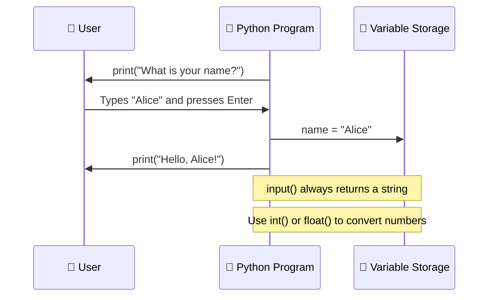

> ⚠️ **Important:** `input()` always returns a **string**. If you need a number, convert it with `int()` or `float()`.

---

## 6. Conditional Statements (if/elif/else)

Make decisions in your code — execute different blocks based on conditions.

```
┌─────────────────────────────────────────────────────┐
│           IF / ELIF / ELSE STRUCTURE                │
│                                                     │
│   if condition1:        ← Test first condition      │
│       do this           ← Run if condition1 True    │
│   elif condition2:      ← Test second condition     │
│       do this           ← Run if condition2 True    │
│   else:                 ← If nothing above matched  │
│       do this           ← Run as default            │
└─────────────────────────────────────────────────────┘
```

```python
# Simple if statement
age = 18

if age >= 18:
    print("You are an adult.")
else:
    print("You are a minor.")

# Multiple conditions with elif
score = 75

if score >= 90:
    grade = "A"
elif score >= 80:
    grade = "B"
elif score >= 70:
    grade = "C"
elif score >= 60:
    grade = "D"
else:
    grade = "F"

print(f"Your grade is: {grade}")   # Your grade is: C
```

### Comparison & Logical Operators

```python
# Comparison operators
x = 10
print(x == 10)   # True  → equal to
print(x != 5)    # True  → not equal to
print(x > 8)     # True  → greater than
print(x < 5)     # False → less than
print(x >= 10)   # True  → greater than or equal
print(x <= 10)   # True  → less than or equal

# Logical operators — combine conditions
a = True
b = False
print(a and b)   # False → BOTH must be True
print(a or b)    # True  → at least ONE must be True
print(not a)     # False → flips the value
```

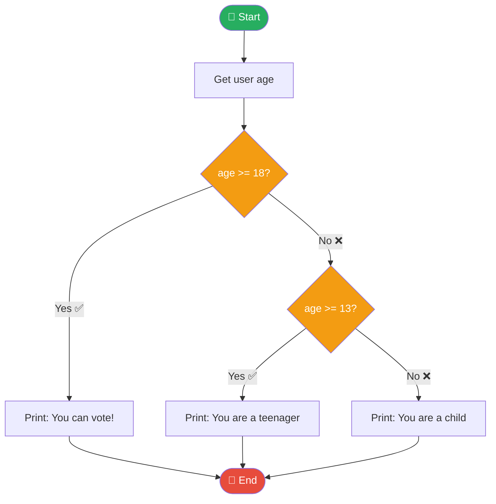

---

## 7. Lists

A **list** is an ordered, changeable collection of items — the most used data structure in Python.

```
┌──────────────────────────────────────────────────┐
│   fruits = ["apple", "banana", "cherry"]         │
│              ↑          ↑         ↑              │
│            [0]        [1]       [2]              │
│   Index starts at ZERO!                          │
└──────────────────────────────────────────────────┘
```

```python
# Creating a list
fruits = ["apple", "banana", "cherry"]
numbers = [1, 2, 3, 4, 5]
mixed = [42, "hello", True, 3.14]   # Lists can hold different types!

# Accessing items (indexing)
print(fruits[0])    # apple  (first item)
print(fruits[-1])   # cherry (last item)
print(fruits[1:3])  # ['banana', 'cherry']

# Modifying a list
fruits[1] = "mango"            # Change item
fruits.append("grape")         # Add to end
fruits.insert(1, "kiwi")      # Insert at position 1
removed = fruits.pop()         # Remove and return last item
fruits.remove("apple")         # Remove by value

# List information
print(len(fruits))             # Number of items
print("mango" in fruits)       # True — check if item exists
fruits.sort()                  # Sort alphabetically
fruits.reverse()               # Reverse the order
print(fruits.count("kiwi"))    # Count occurrences
```

### Common List Operations at a Glance

```
┌─────────────────────────────────────────────────────────┐
│                LIST METHODS CHEAT SHEET                 │
├────────────────────┬────────────────────────────────────┤
│ .append(x)         │ Add x to the end                   │
│ .insert(i, x)      │ Insert x at index i                │
│ .remove(x)         │ Remove first occurrence of x       │
│ .pop()             │ Remove & return last item           │
│ .pop(i)            │ Remove & return item at index i    │
│ .sort()            │ Sort in ascending order             │
│ .reverse()         │ Reverse the list                   │
│ .index(x)          │ Find index of x                    │
│ .count(x)          │ Count occurrences of x             │
│ .clear()           │ Remove all items                   │
└────────────────────┴────────────────────────────────────┘
```

---

## 8. Tuples

A **tuple** is like a list but **immutable** — once created, it cannot be changed.

```python
# Creating a tuple (use parentheses)
coordinates = (10, 20)
colors = ("red", "green", "blue")
single = (42,)    # Note the comma — needed for single-item tuple!

# Accessing (same as lists)
print(colors[0])   # red
print(colors[-1])  # blue

# Tuple unpacking — assign each element to a variable
x, y = coordinates
print(x)   # 10
print(y)   # 20

# Practical use: returning multiple values from a function
def get_dimensions():
    return (1920, 1080)   # width, height

width, height = get_dimensions()
print(f"Screen: {width}x{height}")   # Screen: 1920x1080
```

### List vs Tuple — When to Use Which?

```
┌──────────────────────┬──────────────────────────────────┐
│       LIST  []       │         TUPLE  ()                │
├──────────────────────┼──────────────────────────────────┤
│ Mutable (changeable) │ Immutable (fixed forever)        │
│ Shopping cart        │ GPS coordinates                  │
│ Todo items           │ Days of the week                 │
│ Student grades       │ RGB color values (255, 128, 0)   │
│ Use when data        │ Use when data should             │
│ changes over time    │ never change                     │
└──────────────────────┴──────────────────────────────────┘
```

---

## 9. Dictionaries

A **dictionary** stores data as **key: value pairs** — like a real dictionary with words and definitions.

```
┌──────────────────────────────────────────────────────────┐
│   student = {"name": "Alice", "age": 20, "gpa": 3.8}    │
│                  ↑      ↑       ↑    ↑     ↑    ↑       │
│                 key   value    key  value  key  value    │
└──────────────────────────────────────────────────────────┘
```

```python
# Creating a dictionary
person = {
    "name": "Alice",
    "age": 25,
    "city": "Chennai",
    "is_student": True
}

# Accessing values by key
print(person["name"])          # Alice
print(person.get("age"))       # 25  (safer — returns None if key missing)
print(person.get("phone", "N/A"))  # N/A  (default if not found)

# Modifying dictionaries
person["email"] = "alice@email.com"  # Add new key
person["age"] = 26                   # Update existing key
del person["is_student"]             # Delete a key

# Looping through a dictionary
for key, value in person.items():
    print(f"{key}: {value}")

# Useful dictionary methods
print(person.keys())      # All keys
print(person.values())    # All values
print(len(person))        # Number of key-value pairs
print("name" in person)   # True — check if key exists
```

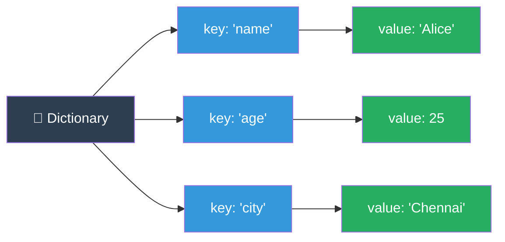

---

## 10. Loops — for loop

A **for loop** repeats a block of code for each item in a sequence.

```
┌─────────────────────────────────────────────────────────┐
│   for item in collection:                               │
│       do something with item     ← repeats each time   │
│                                                         │
│   Think: "For EACH item IN the collection, do this"    │
└─────────────────────────────────────────────────────────┘
```

```python
# Loop through a list
fruits = ["apple", "banana", "cherry"]
for fruit in fruits:
    print(f"I like {fruit}")

# Output:
# I like apple
# I like banana
# I like cherry

# Loop with range() — generates numbers
for i in range(5):          # 0, 1, 2, 3, 4
    print(i)

for i in range(1, 6):       # 1, 2, 3, 4, 5
    print(i)

for i in range(0, 10, 2):   # 0, 2, 4, 6, 8  (step of 2)
    print(i)

# Loop through a string
for letter in "Python":
    print(letter)    # P, y, t, h, o, n  (one per line)

# Loop with index using enumerate()
fruits = ["apple", "banana", "cherry"]
for index, fruit in enumerate(fruits):
    print(f"{index + 1}. {fruit}")
# Output: 1. apple  2. banana  3. cherry
```

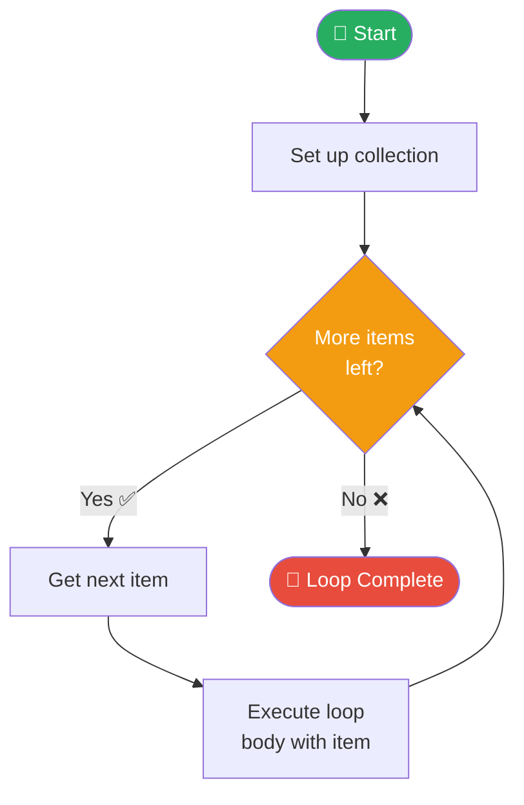

---

## 11. Loops — while loop

A **while loop** repeats a block of code **as long as a condition is True**.

```python
# Basic while loop
count = 1

while count <= 5:
    print(f"Count: {count}")
    count += 1    # IMPORTANT: must update, else infinite loop!

# Output: Count: 1  Count: 2  Count: 3  Count: 4  Count: 5

# while with user input
password = ""
while password != "secret123":
    password = input("Enter password: ")
    if password != "secret123":
        print("Wrong! Try again.")
print("Access granted! ✅")

# break — exit the loop immediately
for number in range(1, 100):
    if number == 5:
        break         # Stop when we hit 5
    print(number)
# Output: 1  2  3  4

# continue — skip current iteration and continue
for number in range(1, 10):
    if number % 2 == 0:
        continue      # Skip even numbers
    print(number)
# Output: 1  3  5  7  9 (odd numbers only)
```

### for vs while — Which to Use?

```
┌───────────────────────────┬───────────────────────────┐
│       for loop            │       while loop          │
├───────────────────────────┼───────────────────────────┤
│ You KNOW how many times   │ You DON'T know how many   │
│ the loop will run         │ times it will run         │
│                           │                           │
│ Loop through a list       │ Keep asking user until    │
│ Repeat exactly N times    │ they give valid input     │
│ Process each file         │ Wait until timer runs out │
└───────────────────────────┴───────────────────────────┘
```

---

## 12. Functions

A **function** is a reusable block of code that performs a specific task.

```
┌─────────────────────────────────────────────────────────┐
│               ANATOMY OF A FUNCTION                     │
│                                                         │
│   def function_name(parameter1, parameter2):           │
│       """Docstring: what this function does"""          │
│       # code goes here                                  │
│       return result     ← send back a value (optional) │
└─────────────────────────────────────────────────────────┘
```

```python
# Function with no parameters
def say_hello():
    print("Hello! Welcome to Python!")

say_hello()   # Call the function

# Function with parameters
def greet(name):
    print(f"Hello, {name}!")

greet("Alice")   # Hello, Alice!
greet("Bob")     # Hello, Bob!

# Function with return value
def add(a, b):
    result = a + b
    return result

total = add(5, 3)
print(total)   # 8

# Function with default parameter
def greet_with_title(name, title="Mr."):
    print(f"Hello, {title} {name}!")

greet_with_title("Smith")           # Hello, Mr. Smith!
greet_with_title("Alice", "Dr.")    # Hello, Dr. Alice!

# Function with multiple return values
def get_min_max(numbers):
    return min(numbers), max(numbers)

minimum, maximum = get_min_max([3, 1, 4, 1, 5, 9])
print(f"Min: {minimum}, Max: {maximum}")  # Min: 1, Max: 9
```

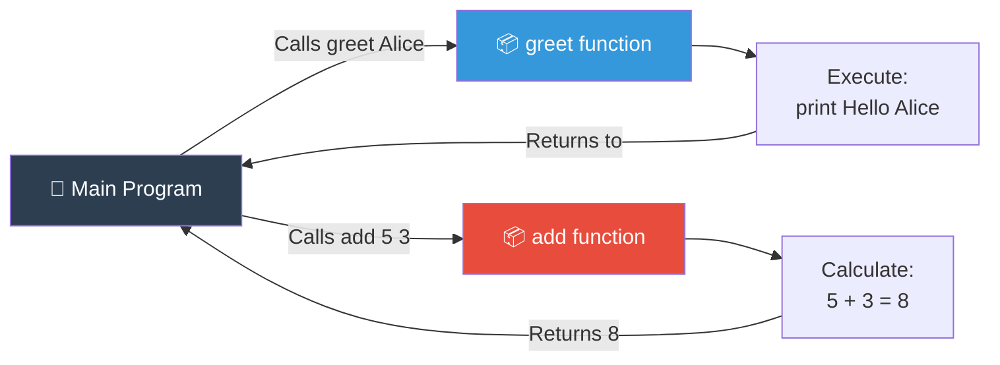

---

## 13. Scope: Local vs Global Variables

**Scope** defines where a variable is accessible in your program.

```python
# Global variable — accessible everywhere
global_message = "I am global!"

def my_function():
    # Local variable — only exists inside this function
    local_message = "I am local!"
    print(global_message)   # ✅ Can access global
    print(local_message)    # ✅ Can access local

my_function()
print(global_message)   # ✅ Works
# print(local_message)  # ❌ ERROR — local_message doesn't exist here

# Modifying a global variable inside a function
counter = 0

def increment():
    global counter      # Tell Python to use the global counter
    counter += 1

increment()
increment()
print(counter)   # 2
```

```
┌──────────────────────────────────────────────────────────┐
│                  SCOPE VISUALIZATION                     │
│                                                          │
│   ┌─────────────────────────────────────────────────┐   │
│   │              GLOBAL SCOPE                       │   │
│   │  global_var = "hello"                           │   │
│   │                                                 │   │
│   │   ┌─────────────────────────────────────────┐  │   │
│   │   │         FUNCTION SCOPE                  │  │   │
│   │   │  local_var = "world"                    │  │   │
│   │   │  ✅ Can see: global_var                 │  │   │
│   │   │  ✅ Can see: local_var                  │  │   │
│   │   └─────────────────────────────────────────┘  │   │
│   │                                                 │   │
│   │  ✅ Can see: global_var                         │   │
│   │  ❌ Cannot see: local_var                       │   │
│   └─────────────────────────────────────────────────┘   │
└──────────────────────────────────────────────────────────┘
```

---

## 14. Error Handling (try/except)

Handle errors gracefully so your program doesn't crash.

```python
# Without error handling — program crashes!
# number = int("hello")  # ValueError: invalid literal for int()

# With error handling — program continues!
try:
    number = int(input("Enter a number: "))
    result = 100 / number
    print(f"100 ÷ {number} = {result}")
except ValueError:
    print("❌ That's not a valid number!")
except ZeroDivisionError:
    print("❌ Cannot divide by zero!")
except Exception as e:
    print(f"❌ An unexpected error occurred: {e}")
else:
    print("✅ Calculation successful!")      # Runs if NO error occurred
finally:
    print("This always runs regardless!")   # Runs ALWAYS
```

### Common Error Types

```
┌──────────────────────┬──────────────────────────────────────┐
│   Error Type         │   When it occurs                     │
├──────────────────────┼──────────────────────────────────────┤
│ ValueError           │ Wrong type conversion: int("abc")    │
│ TypeError            │ Wrong operation: "a" + 5             │
│ ZeroDivisionError    │ Dividing by zero: 10 / 0             │
│ IndexError           │ List index out of range: lst[99]     │
│ KeyError             │ Dict key not found: d["missing"]     │
│ FileNotFoundError    │ Opening a file that doesn't exist    │
│ NameError            │ Using undefined variable             │
└──────────────────────┴──────────────────────────────────────┘
```

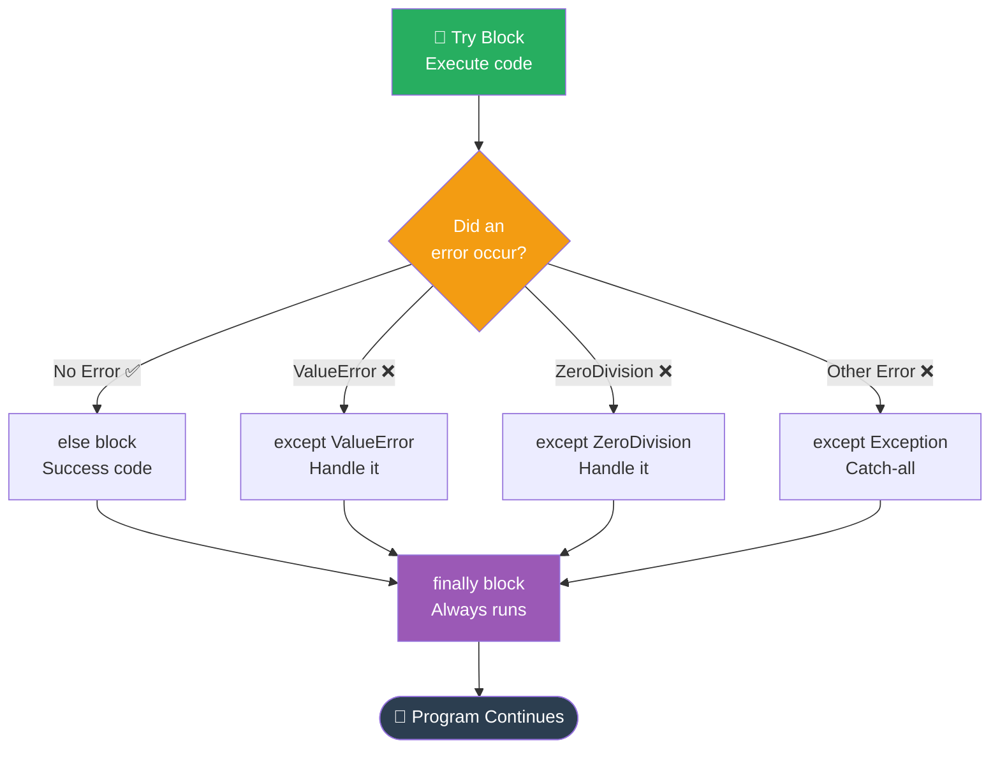

---

## 15. File Handling

Read from and write to files — essential for data storage and persistence.

```python
# Writing to a file
with open("notes.txt", "w") as file:    # "w" = write mode
    file.write("Hello, File!\n")
    file.write("This is a second line.\n")

# "with" automatically closes the file — always use it!

# Reading from a file
with open("notes.txt", "r") as file:   # "r" = read mode
    content = file.read()              # Read entire file
    print(content)

# Read line by line
with open("notes.txt", "r") as file:
    for line in file:
        print(line.strip())    # strip() removes newline characters

# Appending to a file (add content without deleting existing)
with open("notes.txt", "a") as file:   # "a" = append mode
    file.write("This line is appended!\n")

# Check if file exists before opening
import os
if os.path.exists("notes.txt"):
    print("File found!")
else:
    print("File does not exist.")
```

### File Modes Reference

```
┌──────┬─────────────────────────────────────────────────┐
│ Mode │ Description                                     │
├──────┼─────────────────────────────────────────────────┤
│ "r"  │ Read (file must exist)                         │
│ "w"  │ Write (creates file, OVERWRITES if exists)     │
│ "a"  │ Append (adds to end, creates if not exist)     │
│ "r+" │ Read and Write                                 │
│ "x"  │ Create new (fails if file already exists)      │
└──────┴─────────────────────────────────────────────────┘
```

---

## 16. List Comprehensions

A **list comprehension** creates a new list in a single, elegant line.

```python
# Traditional way (4 lines)
squares = []
for x in range(1, 6):
    squares.append(x ** 2)
print(squares)   # [1, 4, 9, 16, 25]

# List comprehension (1 line — same result!)
squares = [x ** 2 for x in range(1, 6)]
print(squares)   # [1, 4, 9, 16, 25]

# With condition (filter even numbers)
evens = [x for x in range(1, 11) if x % 2 == 0]
print(evens)     # [2, 4, 6, 8, 10]

# Transform strings
fruits = ["apple", "banana", "cherry"]
upper_fruits = [fruit.upper() for fruit in fruits]
print(upper_fruits)   # ['APPLE', 'BANANA', 'CHERRY']

# Extract values from a list of dictionaries
students = [
    {"name": "Alice", "grade": 90},
    {"name": "Bob", "grade": 75},
    {"name": "Carol", "grade": 85}
]
names = [s["name"] for s in students if s["grade"] >= 80]
print(names)   # ['Alice', 'Carol']
```

```
┌─────────────────────────────────────────────────────────┐
│           LIST COMPREHENSION STRUCTURE                  │
│                                                         │
│   [expression  for item in iterable  if condition]     │
│        ↑             ↑                    ↑            │
│    what to        loop variable       optional         │
│    produce        and source          filter           │
│                                                         │
│   Example:                                              │
│   [x*2  for x in range(5)  if x > 1]                  │
│   → [4, 6, 8]                                          │
└─────────────────────────────────────────────────────────┘
```

---

## 17. Modules & Importing

**Modules** are Python files containing reusable code. Python has hundreds of built-in modules.

```python
# Import the entire module
import math
print(math.sqrt(25))    # 5.0
print(math.pi)          # 3.14159...

# Import specific functions (cleaner)
from math import sqrt, pi, ceil
print(sqrt(36))         # 6.0
print(ceil(4.1))        # 5

# Import with an alias (nickname)
import random as rnd
import datetime as dt

# Random module — generate random numbers
import random
print(random.randint(1, 10))        # Random int between 1 and 10
print(random.choice(["a","b","c"])) # Random item from list
print(random.random())              # Random float between 0 and 1

# Datetime module — work with dates and times
from datetime import datetime
now = datetime.now()
print(now)                          # 2024-01-15 14:30:00
print(now.strftime("%d/%m/%Y"))     # 15/01/2024
print(now.year, now.month, now.day) # 2024 1 15

# OS module — interact with the operating system
import os
print(os.getcwd())          # Current working directory
print(os.listdir("."))      # List files in current folder
```

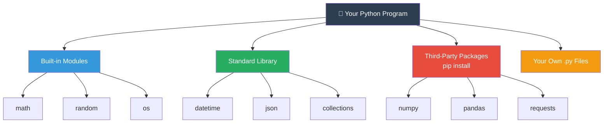

---

## 18. Classes & Objects (OOP Basics)

**Object-Oriented Programming (OOP)** models real-world things as objects with properties and behaviors.

```
┌─────────────────────────────────────────────────────────┐
│                  CLASS = BLUEPRINT                      │
│                                                         │
│   Class: Dog                                            │
│   ┌─────────────────────────────────────┐              │
│   │  Attributes (properties):           │              │
│   │    name, breed, age                 │              │
│   │                                     │              │
│   │  Methods (behaviors/actions):       │              │
│   │    bark(), eat(), fetch()           │              │
│   └─────────────────────────────────────┘              │
│                                                         │
│   Objects (instances of the class):                     │
│   buddy = Dog("Buddy", "Labrador", 3)                  │
│   max   = Dog("Max",   "Poodle",   5)                  │
└─────────────────────────────────────────────────────────┘
```

```python
# Define a class
class Dog:
    # __init__ is the constructor — called when creating an object
    def __init__(self, name, breed, age):
        self.name = name       # Instance attribute
        self.breed = breed
        self.age = age

    # Method — a function inside a class
    def bark(self):
        print(f"{self.name} says: Woof! 🐾")

    def info(self):
        print(f"{self.name} is a {self.breed}, {self.age} years old.")

    def birthday(self):
        self.age += 1
        print(f"Happy Birthday, {self.name}! Now {self.age} years old. 🎂")


# Create objects (instances)
buddy = Dog("Buddy", "Labrador", 3)
max_dog = Dog("Max", "Poodle", 5)

# Use the objects
buddy.bark()          # Buddy says: Woof! 🐾
max_dog.info()        # Max is a Poodle, 5 years old.
buddy.birthday()      # Happy Birthday, Buddy! Now 4 years old. 🎂

print(buddy.name)     # Buddy  — access attributes directly
print(max_dog.breed)  # Poodle
```

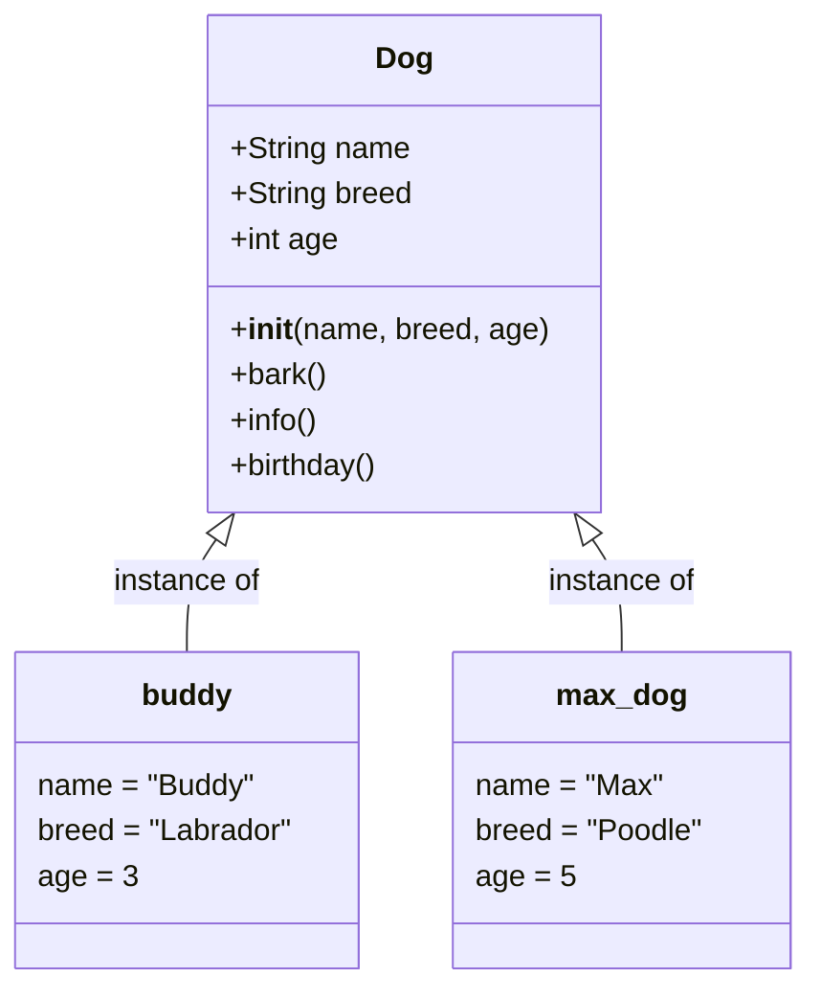

---

## 19. Lambda Functions

A **lambda function** is a small, anonymous (nameless) function written in one line.

```python
# Regular function
def square(x):
    return x ** 2

# Equivalent lambda function
square = lambda x: x ** 2

print(square(5))   # 25

# Lambda with multiple parameters
add = lambda a, b: a + b
print(add(3, 4))   # 7

multiply = lambda x, y: x * y
print(multiply(6, 7))   # 42
```

### Lambdas with sorted() and filter()

```python
# Sort a list of dictionaries by a key
students = [
    {"name": "Bob", "grade": 75},
    {"name": "Alice", "grade": 92},
    {"name": "Carol", "grade": 85}
]

# Sort by grade (ascending)
sorted_students = sorted(students, key=lambda s: s["grade"])
for s in sorted_students:
    print(f"{s['name']}: {s['grade']}")

# Output:
# Bob: 75
# Carol: 85
# Alice: 92

# Filter — keep only students who passed
passed = list(filter(lambda s: s["grade"] >= 80, students))
print([s["name"] for s in passed])   # ['Alice', 'Carol']

# Map — apply a function to every element
numbers = [1, 2, 3, 4, 5]
doubled = list(map(lambda x: x * 2, numbers))
print(doubled)   # [2, 4, 6, 8, 10]
```

```
┌────────────────────────────────────────────────────────┐
│              LAMBDA SYNTAX                             │
│                                                        │
│   lambda  parameters  :  expression                   │
│     ↑          ↑              ↑                       │
│   keyword   inputs      what to return                │
│                                                        │
│   lambda x, y : x + y                                 │
│   → takes x and y, returns their sum                  │
└────────────────────────────────────────────────────────┘
```

---

## 20. Common Built-in Functions

Python has many powerful built-in functions — no import needed!

```python
# len() — length of sequence
print(len("Hello"))         # 5
print(len([1, 2, 3]))       # 3
print(len({"a": 1, "b": 2}))  # 2

# type() — get data type
print(type(42))             # <class 'int'>
print(type("hello"))        # <class 'str'>

# range() — generate number sequences
list(range(5))              # [0, 1, 2, 3, 4]
list(range(1, 10, 2))       # [1, 3, 5, 7, 9]

# min(), max(), sum()
nums = [3, 1, 4, 1, 5, 9]
print(min(nums))            # 1
print(max(nums))            # 9
print(sum(nums))            # 23

# abs(), round()
print(abs(-42))             # 42
print(round(3.14159, 2))    # 3.14

# sorted() — returns sorted list (doesn't modify original)
original = [3, 1, 4, 1, 5]
sorted_list = sorted(original)
print(sorted_list)   # [1, 1, 3, 4, 5]
print(original)      # [3, 1, 4, 1, 5]  ← unchanged!

# zip() — combine two lists
names = ["Alice", "Bob", "Carol"]
scores = [90, 75, 85]
for name, score in zip(names, scores):
    print(f"{name}: {score}")

# enumerate() — loop with index
for i, name in enumerate(names, start=1):
    print(f"{i}. {name}")

# isinstance() — check if value is a certain type
print(isinstance(42, int))    # True
print(isinstance("hi", str))  # True
```

```
┌──────────────────────────────────────────────────────────┐
│             BUILT-IN FUNCTIONS QUICK REFERENCE          │
├─────────────────┬────────────────────────────────────────┤
│ print()         │ Display output                         │
│ input()         │ Get user input                         │
│ len()           │ Get length                             │
│ type()          │ Get data type                          │
│ int/float/str() │ Convert types                          │
│ range()         │ Generate number sequence               │
│ min/max/sum()   │ Math operations on sequences           │
│ abs()           │ Absolute value                         │
│ round()         │ Round a number                         │
│ sorted()        │ Return sorted copy                     │
│ zip()           │ Combine two sequences                  │
│ enumerate()     │ Loop with index                        │
│ map()           │ Apply function to all elements         │
│ filter()        │ Keep elements matching condition       │
│ isinstance()    │ Check data type                        │
└─────────────────┴────────────────────────────────────────┘
```

---

## 🎯 Python Learning Roadmap

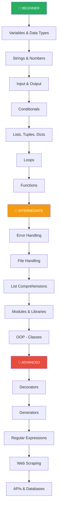

---

## 📝 Practice Projects for Beginners

| Project | Concepts Used |
|---------|--------------|
| 🔢 Calculator | Variables, input, math operators, functions |
| 🎲 Number Guessing Game | Variables, loops, conditionals, random |
| 📋 Todo List | Lists, loops, functions, file handling |
| 🌡️ Temperature Converter | Functions, input/output, math |
| 📊 Student Grade Tracker | Dictionaries, lists, loops, functions |
| 🔐 Password Generator | Random, string methods, loops |

---

## 💡 Golden Rules for Python Beginners

```
┌─────────────────────────────────────────────────────────┐
│                   REMEMBER THESE!                       │
│                                                         │
│  1️⃣  Indentation matters — use 4 spaces consistently   │
│  2️⃣  Variables are case-sensitive: name ≠ Name ≠ NAME  │
│  3️⃣  Comments start with # — use them liberally        │
│  4️⃣  Python index starts at 0, not 1                   │
│  5️⃣  input() always returns a string                   │
│  6️⃣  Read error messages — they tell you exactly       │
│       what went wrong!                                  │
│  7️⃣  Practice every day — even 15 minutes helps        │
│  8️⃣  Break big problems into smaller functions         │
└─────────────────────────────────────────────────────────┘
```

---

*Happy Coding! 🐍✨ — Python is a journey, not a destination. Keep building, keep learning!*
